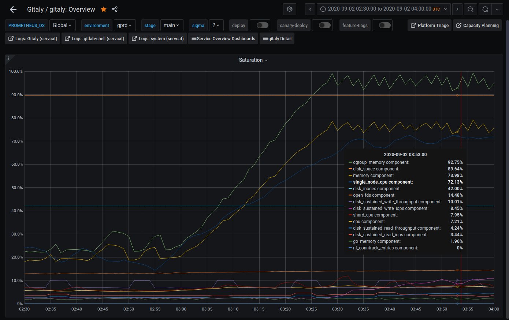
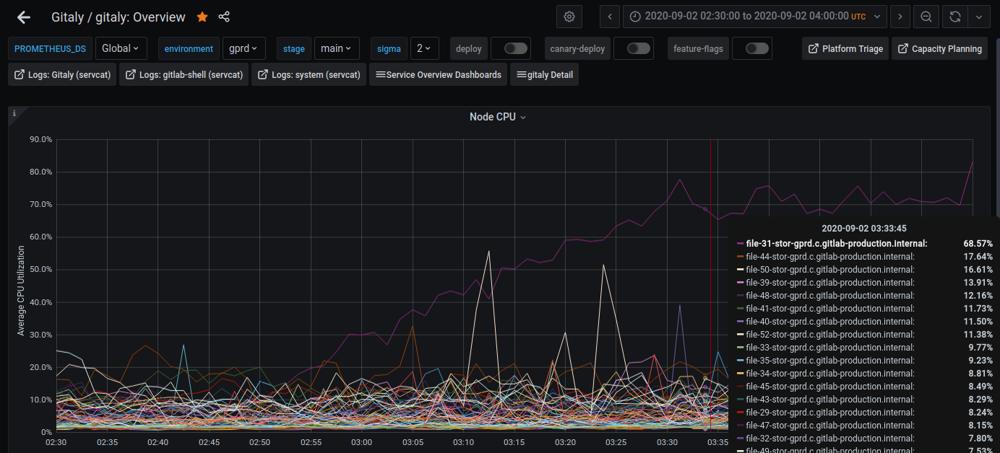
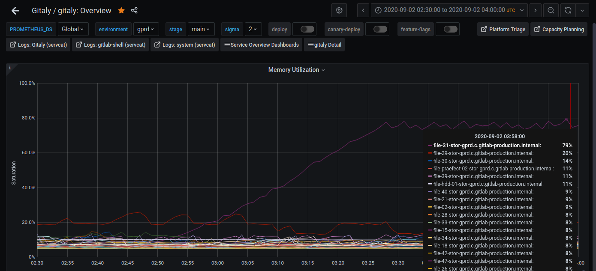
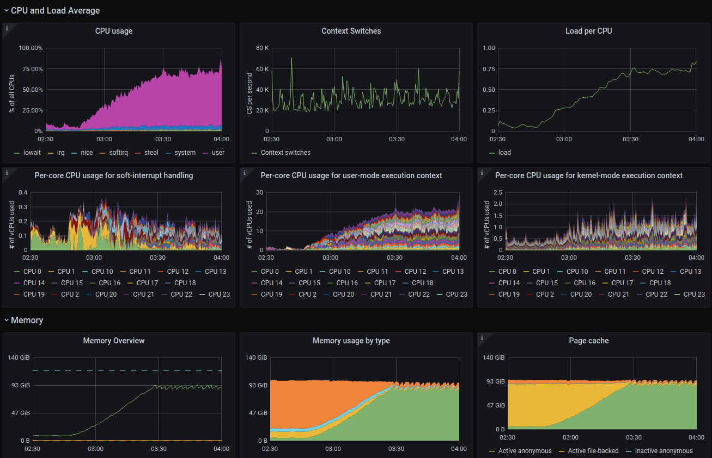

## Problem: git processes spawned by Gitaly may consume significant CPU and memory

Gitaly routinely spawns `git` child processes to perform tasks on individual repos.

These processes are usually short-lived.  However, in some cases, they can be
both long-lived and resource-intensive.

The most common observed pattern for this is when many `git pack-objects` processes
are each consuming up to 1 whole CPU and a large amount (> 1 GB) of resident anonymous memory.

This runbook walks through an example of that scenario.
See also [this incident](https://gitlab.com/gitlab-com/gl-infra/production/-/issues/2600)
as another example walk-through of this behavior.


## Quick reference commands

The walk-through gives more context, but for quick reference in a pinch:

### Diagnostic commands

Find `git pack-objects` processes that are children of `git upload-pack` (rather than `git repack`).
Each of these processes corresponds to one git client running `git fetch` or `git clone`.  Killing them will gracefully abort the client and will not harm the repo.

Notes:
* This step defines a bash alias `find_git_pack_pids` to use as a macro function in several later steps.  If your shell is not Bash, please adjust accordingly.
* Because the list of PIDs may change quickly, it is helpful to have a dynamic function to find the currently running matching PIDs.
* If you prefer to work with a static list of PIDs, you can substitute `$( echo <PID> ... )` instead of running the `find_git_pack_pids` bash alias.

```shell
$ alias find_git_pack_pids=$"pgrep -f 'git .*upload-pack' | tr '\n' ',' | perl -pe 's/,$//' | xargs -i pgrep --parent {} -f 'git .*pack-objects .*--stdout'"
$ find_git_pack_pids | xargs -r ps uwf | cat
```

Which git repo directory are most of these git-pack-objects processes using?

```shell
$ find_git_pack_pids | xargs -i sudo ls -l /proc/{}/cwd | perl -pe 's/.* -> //' | sort | uniq -c | sort -rn
```

Show the GitLab correlation_id for these "git pack-objects" processes.

Note: The Kibana indexes for Gitaly and Workhorse may not have log events for these correlation_ids until these processes exit.

```shell
$ find_git_pack_pids | xargs -i sudo cat /proc/{}/environ | tr '\0' '\n' | grep 'CORRELATION_ID'
```

What is the GitLab project path for a git repo?
You can use this in Kibana queries or to browse to the project as an admin of gitlab.com.

```shell
$ TARGET_GIT_DIR='/var/opt/gitlab/git-data/repositories/@hashed/71/40/71408c63d137df0bf79664aa4371ecd00a6682a3e52e08c976487e52ea6b3dad.git'
$ sudo grep 'fullpath' $TARGET_GIT_DIR/config
```

Capture a 30-second "perf" CPU profile for the whole host.

Open the flamegraph in a javascript-enabled browser.
As a distinctive feature of the pathology we are documented here, the `git` processes are expected to be spending most of their CPU time
in the call chain: `cmd_pack_objects` -> `find_deltas` -> `create_delta`.  This means Git is computing delta objects on a pair of base objects
in an effort to see if sending the delta would cost less network bandwidth than sending the whole base object.  For large objects, this can
be very expensive.

```shell
$ sudo perf record -a -g --freq 99 -- sleep 30
$ sudo perf script --header > $( hostname -s ).perf-script.txt
$ git clone --quiet https://github.com/brendangregg/FlameGraph.git ~/FlameGraph
$ PATH="$HOME/FlameGraph:$PATH"
$ cat $( hostname -s ).perf-script.txt | stackcollapse-perf.pl --kernel | flamegraph.pl --hash --colors=perl > $( hostname -s ).flamegraph.svg
```

Or to capture a 30-second "perf" CPU profile of only the `git pack-objects` PIDs, replace the 1st step of the above commands with:

```shell
$ find_git_pack_pids | tr '\n' ',' | perl -pe 's/,$//' | xargs -i sudo perf record -g --freq 99 --pid {} -- sleep 30
```

How many objects are in this git repo?

```shell
sudo git -C "$TARGET_GIT_DIR" cat-file --batch-all-objects --batch-check='%(objecttype)' | sort | uniq -c
```

How many large objects in this git repo are over 100 MB?

```shell
sudo git -C "$TARGET_GIT_DIR" cat-file --batch-all-objects --batch-check='%(objectname) %(objecttype) %(objectsize)' | awk '$3 >= 100*1024^2' | sort -k3 -n -r | wc -l
```


### Remedies

Once we identify the affected git repo and its associated gitlab project (e.g. using the methods above),
we can take any combination of the following actions.


#### Kill `git pack-objects` processes

**WARNING:** Ideally we only want to kill `git pack-objects` processes that were spawned by `git upload-pack`.  Try to avoid killing the ones spawned by `git repack`. 

To instantly reduce CPU and memory pressure, kill some or all of the `git pack-objects` processes associated with that git repo.
Often this is enough to resolve the immediate problem, and its effect is mild: the active git clients fail their clone/fetch attempt.

The attached script does exactly that:
Find and kill any `git pack-objects` process that is a child of `upload-pack` and is operating on the given repo directory.

Its only argument is the absolute path to a git repo.

[kill_git_pack_objects_processes_for_repo_path.sh](../../scripts/kill_git_pack_objects_processes_for_repo_path.sh)

```shell
$ TARGET_GIT_DIR='/var/opt/gitlab/git-data/repositories/@hashed/71/40/71408c63d137df0bf79664aa4371ecd00a6682a3e52e08c976487e52ea6b3dad.git'
$ ./kill_git_pack_objects_processes_for_repo_path.sh "$TARGET_GIT_DIR"
```


#### Block the repo

To block anonymous clients from running `git clone` or `git fetch` on this repo, either:
* Contact the Trust and Safety Team (formerly the Abuse Team) via slack handle `@trust-and-safety`, and ask them to block the project using Bouncer.
* Login as an Admin to the GitLab web UI, browse to the project, and mark it as "Private".  This blocks anonymous access but does not block authorized members.


#### Run `git repack` on the repo

There is an automation routine for this that temporarily blocks writes to the repo while the repack is running.

Try to avoid running repack manually, but if you have to do so, prefer to use the build of `git` that comes from the `gitlab-ee` package:

```
/opt/gitlab/embedded/bin/git
```

If you use the default `git` (which is `/usr/bin/git`), it will use slightly different gitconfig settings.  Not a big deal currently, but a good thing to keep in mind.

#### Run the housekeeping job on the project

1. Login to Gitlab using an admin account
2. Go to the page of the project for which you want to run the repack (the page might be slow or unresponsive since Gitaly is probably overloaded at this point)
3. Go to the project settings on the left hand side and trigger the housekeeping job: Settings -> General -> Advanced -> [Run Housekeeping]

#### Tune how this repo handles large objects

**WARNING:** This method is currently (2020-09-01) experimental.

The most common way for `git pack-objects` processes to become CPU and memory intensive is when they decide to try to calculate
a "delta" object (i.e. a diff) where the base object is very large (e.g. 100 MB) but still smaller than 512 MB (the default value for `core.bigFileThreshold`).

Reducing `core.bigFileThreshold` makes git not even attempt to calculate a delta object for that base blob object.

This is a trade-off: Computing deltas costs CPU and memory but potentially saves storage space and network bandwidth.

Reducing this threshold to be smaller than the size of the largest objects in the repo will avoid the cost of computing deltas,
but it may shift the burden to costing more network throughput and potentially even spend extra CPU time working with the large blob
instead of what might have been a much smaller delta object.

As a first draft, it may be worth trying a smaller `core.bigFileThreshold` if the repo has:
* at least one large object (< 512 MB and > 100 MB)
* fairly few commits
* low rate of new commits being pushed


## Symptoms

Symptoms of the problem include:
* The latency apdex or error rate spikes for the `web` and `api` backends in HAProxy.  This may trigger alerts if severe enough.
* One Gitaly node's CPU and anonymous memory usage rises significantly above its peers and above its recent norm.
* Running "top" on the affected Gitaly node shows many CPU-bound `git pack-objects` processes.
  * Most of these processes are children of `git-upload-pack` and are associated with a single git repo.  (See below for how to check this.)

In more detail:
* For one Gitaly host, CPU or memory usage rises significantly above the norm, potentially reaching saturation for the host or cgroup.
  * Typically a single git repo will be associated with most of the running `git pack-objects` processes.
* CPU saturation can starve other processes, lead to general slowness and timeout errors for other RPC calls to the affected Gitaly node.
* Memory pressure from processes collectively allocating a lot of anonymous memory can deplete the filesystem cache (leading to
  extra disk I/O and its related slowness) and potentially cause other processes to be killed by the kernel's out-of-memory killer.
  * Gitaly's ruby worker child processes are an attractive target for the out-of-memory killer. If it chooses one of them as a victim,
    Gitaly will automatically spawn a replacement, but it will cause an error rate spike.
* The affected Gitaly node's slowness and timeouts noted above will typically lead to higher latency and error rates on Gitaly's
  clients, primarily Workhorse and Rails on the `web`, `api`, and `git` fleets.


## How to diagnose this problem

### Dashboards

* [GitLab Triage - section HAProxy - panel 5xx responses](https://dashboards.gitlab.net/d/RZmbBr7mk/gitlab-triage?viewPanel=1197)
  * Sort the legend by its `max` column.
  * This panel will show elevated error rates from multiple backends, typically most obviously affecting `web`, `api`, and `api_rate_limit`.
* [Gitaly overview - section Node Metrics - panel Node CPU](https://dashboards.gitlab.net/d/gitaly-main/gitaly-overview?viewPanel=47)
  * Typically only one git repo is involved, so a single Gitaly node will be affected by the increasing CPU usage.
* [Gitaly overview - section Node Metrics - panel Node Memory](https://dashboards.gitlab.net/d/gitaly-main/gitaly-overview?viewPanel=50)
  * Typically only one git repo is involved, so a single Gitaly node will be affected by the increasing memory usage.
* [Host Stats](https://dashboards.gitlab.net/d/bd2Kl9Imk/host-stats-old-prometheus?var-node=file-31-stor-gprd.c.gitlab-production.internal)
  * Select the affected Gitaly node from the `Host` dropdown.
  * The panels related to CPU and memory usage will show clear patterns of increased usage.
    * [CPU usage](https://dashboards.gitlab.net/d/bd2Kl9Imk/host-stats-old-prometheus?viewPanel=8&var-node=file-31-stor-gprd.c.gitlab-production.internal) rises steadily, potentially reaching 100%.  User-mode CPU time is the main mode that increases.
    * [Memory usage](https://dashboards.gitlab.net/d/bd2Kl9Imk/host-stats-old-prometheus?viewPanel=39&var-node=file-31-stor-gprd.c.gitlab-production.internal) steadily transitions from mostly `Cached` (file-backed pages) to mostly `AnonPages` (anonymous non-file-backed pages, typically processes' heap space).

### Kibana visualizations

* [Gitaly - sum of time spent serving requests, split by method](https://log.gprd.gitlab.net/app/kibana#/visualize/edit/8cbc0d10-edfb-11ea-81e5-155ba78758d4)
  * You can narrow this further down by adding a filter for a specific host, e.g. `json.fqdn` is `file-02-stor-gprd.c.gitlab-production.internal`
  * If the culprit is `PostUploadPack` method, you should see it stand out here
* [Gitaly - sum of time spent serving requests, split by project](https://log.gprd.gitlab.net/app/kibana#/visualize/edit/50fdf910-edfa-11ea-81e5-155ba78758d4)
  * You can narrow this visualization further down by adding filters for a specific host and a specific method. This will show you which project is most likely causing the problem.


## Example

### Top

On the affected Gitaly node, running `top` shows most of the top CPU consuming processes are `git pack-objects` processes.

```
msmiley@file-31-stor-gprd.c.gitlab-production.internal:~$ top

top - 07:22:45 up 567 days, 18:35,  1 user,  load average: 22.49, 22.68, 22.12
Tasks: 702 total,  21 running, 676 sleeping,   0 stopped,   5 zombie
%Cpu(s): 67.0 us,  4.8 sy,  0.0 ni, 26.0 id,  1.5 wa,  0.0 hi,  0.7 si,  0.0 st
KiB Mem : 12377582+total, 24942404 free, 94769184 used,  4064236 buff/cache
KiB Swap:        0 total,        0 free,        0 used. 26105052 avail Mem

  PID USER      PR  NI    VIRT    RES    SHR S  %CPU %MEM     TIME+ COMMAND
 7893 git       20   0 7200124 2.121g  11984 S 102.6  1.8 249:56.98 /opt/gitlab/embedded/bin/gitaly /var/opt/gitlab/gitaly/config.toml
 1159 git       20   0 1840472 1.730g   3824 R 100.0  1.5   2:32.32 /opt/gitlab/embedded/libexec/git-core/git pack-objects --revs --thin --stdout --progress --delta-base-offset --include-tag
 1796 git       20   0 3880284 3.671g   3904 R  99.7  3.1  12:02.75 /opt/gitlab/embedded/libexec/git-core/git pack-objects --revs --thin --stdout --progress --delta-base-offset --include-tag
11234 git       20   0 6486344 6.163g   3856 R  99.7  5.2  39:22.64 /opt/gitlab/embedded/libexec/git-core/git pack-objects --revs --thin --stdout --progress --delta-base-offset --include-tag
 2063 git       20   0 6292836 5.832g   3824 R  99.3  4.9  25:35.65 /opt/gitlab/embedded/libexec/git-core/git pack-objects --revs --thin --stdout --progress --delta-base-offset --include-tag
10414 git       20   0 6581116 6.221g   3888 R  99.3  5.3  35:08.45 /opt/gitlab/embedded/libexec/git-core/git pack-objects --revs --thin --stdout --progress --delta-base-offset --include-tag
15399 git       20   0 3880284 3.679g   3824 R  99.3  3.1   9:56.21 /opt/gitlab/embedded/libexec/git-core/git pack-objects --revs --thin --stdout --progress --delta-base-offset --include-tag
15565 git       20   0 1033536 991.1m   3780 R  99.3  0.8   0:27.12 /opt/gitlab/embedded/libexec/git-core/git pack-objects --revs --thin --stdout --progress --delta-base-offset --include-tag
17589 git       20   0 4466476 4.238g   3856 R  99.3  3.6  18:55.98 /opt/gitlab/embedded/libexec/git-core/git pack-objects --revs --thin --stdout --progress --delta-base-offset --include-tag
19186 git       20   0 2456584 2.315g   3904 R  99.3  2.0   4:36.08 /opt/gitlab/embedded/libexec/git-core/git pack-objects --revs --thin --stdout --progress --delta-base-offset --include-tag
26393 git       20   0 6506296 6.171g   3764 R  99.3  5.2  32:50.17 /opt/gitlab/embedded/libexec/git-core/git pack-objects --revs --thin --stdout --progress --delta-base-offset --include-tag
26637 git       20   0 7279980 6.918g   3864 R  99.3  5.9  41:24.61 /opt/gitlab/embedded/libexec/git-core/git pack-objects --revs --thin --stdout --progress --delta-base-offset --include-tag
 1341 git       20   0 5104296 4.852g   3872 R  99.0  4.1  21:00.41 /opt/gitlab/embedded/libexec/git-core/git pack-objects --revs --thin --stdout --progress --delta-base-offset --include-tag
 8220 git       20   0 4496404 4.270g   3840 R  99.0  3.6  15:48.26 /opt/gitlab/embedded/libexec/git-core/git pack-objects --revs --thin --stdout --progress --delta-base-offset --include-tag
 9806 git       20   0 6486344 6.164g   3892 R  99.0  5.2  29:53.07 /opt/gitlab/embedded/libexec/git-core/git pack-objects --revs --thin --stdout --progress --delta-base-offset --include-tag
21689 git       20   0 5901176 5.611g   3756 R  99.0  4.8  27:47.04 /opt/gitlab/embedded/libexec/git-core/git pack-objects --revs --thin --stdout --progress --delta-base-offset --include-tag
 4690 git       20   0 3106596 2.939g   3816 R  98.7  2.5   6:46.55 /opt/gitlab/embedded/libexec/git-core/git pack-objects --revs --thin --stdout --progress --delta-base-offset --include-tag
14959 git       20   0 5221236 4.961g   3904 R  98.7  4.2  23:33.73 /opt/gitlab/embedded/libexec/git-core/git pack-objects --revs --thin --stdout --progress --delta-base-offset --include-tag
27170 git       20   0 7279980 6.927g   3824 R  98.7  5.9  37:16.53 /opt/gitlab/embedded/libexec/git-core/git pack-objects --revs --thin --stdout --progress --delta-base-offset --include-tag
...
```

### Dashboard Gitaly Overview

The Gitaly Overview dashboard's "Saturation" panel shows that memory and CPU are near or at their saturation point.

The same dashboard's "Node Metrics" section includes CPU and memory panels that identify which specific Gitaly node is affected.

#### Saturation

[Dashboard link](https://dashboards.gitlab.net/d/gitaly-main/gitaly-overview?viewPanel=8&orgId=1&from=1599013800000&to=1599019200000)



#### CPU

[Dashboard link](https://dashboards.gitlab.net/d/gitaly-main/gitaly-overview?viewPanel=47&orgId=1&from=1599013800000&to=1599019200000)



#### Memory

[Dashboard link](https://dashboards.gitlab.net/d/gitaly-main/gitaly-overview?viewPanel=50&orgId=1&from=1599013800000&to=1599019200000)




### Dashboard Host Stats

The Host Stats dashboard shows a variety of general host-level metrics for any single host in the environment.

In this case, the CPU and memory sections are the most relevant.

Disk throughput may also increase as a side-effect of the filesystem cache being depleted by the increase in anonymous memory usage
by the `git pack-objects` processes.

[Dashboard link](https://dashboards.gitlab.net/d/bd2Kl9Imk/host-stats-old-prometheus?orgId=1&var-environment=gprd&var-node=file-31-stor-gprd.c.gitlab-production.internal&var-promethus=prometheus-01-inf-gprd&from=1599013800000&to=1599019200000)




