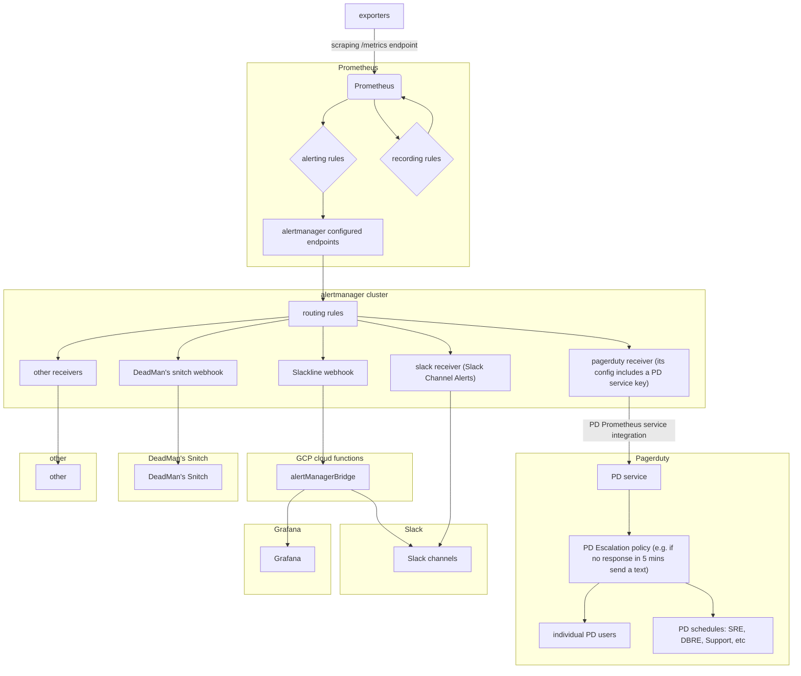

# Alerting

## Overview ##

videos and materials in `./runbooks/docs/monitoring/monitoring-overview.md`

[part V (chapters 18 and 19) of O'Reilly's "Prometheus up and running" book](https://learning.oreilly.com/library/view/prometheus-up/9781492034131/part05.html#part5)

[sre workbook, chapter 5](https://landing.google.com/sre/workbook/chapters/alerting-on-slos/#ch05fn5)



## Prometheus

Generally speaking alerts are triggered by prometheus, and then grouped by label, prioritized and deduped by the alert manager.

Currently most alerts are being grouped by environment and alert name. These alerts are then shipped to the alert manager which applies a template to them to ship them to slack or pagerduty, depending on the `pager` label.

## Alert rule sample

Alert rules, alongside other config such as alertmanager's URL endpoint, are part of Prometheus config. This sample alert rule would trigger pretty much all the time,

```yaml
groups:
- name: testing.rules
  rules:
  - alert: HawaiianHugs
    expr: node_load1{environment="gprd",job="node",type="git"} > 1
    for: 1m
    labels:
      severity: s1
    annotations:
      title: "Emergency Alert"
      description: >
        "BALLISTIC MISSILE THREAT INBOUND TO GITLAB. SEEK IMMEDIATE SHELTER.
        THIS IS NOT A DRILL."
      node_load: '{{ $value }}'
```

### Fields

* alert: the alert name, this will be used as a grouping mechanism.
* expr: the expression to evaluate, has to evaluate to boolean.
* for: how long to wait until this alert starts firing.
* labels: any alert that triggers will include all the labels that come from the prometheus metric, here we can add more labels to manage the alert behavior. We could, for example add more labels like this:
  * channel: which channel the alert should go to, in slack format, for ex: `#production`
  * severity: `critical` for it to be red, `warn` for it to be only a warning (orange)
  * pager: if `pagerduty` then the alert will be also sent to pagerduty to the production on-call
	* environment: this one generally comes with the metric, we can override it to send to different channels (stg, pre, or geo)
* annotations: there are 2 annotations that will be always used: title and descriptions. These should be static (they can't have any variable in them) more on this later on. Additionally we can define as many other annotations as we want, more on this later.

### Annotations

As previously said, there are 2 static annotations that should be used always:

* title: this will be the first line of an alert, should be simple a direct saying what the problem is.
* description: a longer text providing data and context on what this alert is, best if they provide information on how to deal with the alert or which steps to take. Since we are using yaml now it's quite easy to write a really long text, so we should be migrating the runbooks into the alerting.

Besides this, we can add any other annotation that we want, the way this will
work is that for each alert that is grouped the `fqdn` or `instance` will be
printed under the description, one per line, and then any additional annotation
will be printed next to it, this means that we can define as many as we want,
for example, in the previous alert, there will be one line for each node that
matches the expression and it will include the text `node_load = X` once per
each host.

## Alertmanager

Alerts raised by Prometheus, as defined by alert rules, are sent to alertmanager. Alertmanager is configured with routing rules and receivers. Incoming alerts from Prometheus are routed to receivers based on routing rules.


## How to add new alerts (alert rules in Prometheus config)

Create a new yml file under `/rules` in this repo, and submit a MR. Once the MR has been approved &
merged, trigger a chef converge on the `[gstg|gprd|ops]-infra-alerts` roles.

From local clone of `dev.gitlab.org:chef-repo`

```
bundle exec knife ssh 'roles:gstg-infra-alerts'
bundle exec knife ssh 'roles:gprd-infra-alerts'
bundle exec knife ssh 'roles:ops-infra-alerts'
```

In order to get rules deployed into Kubernetes, follow the above and watch the
CI/CD pipeline on the ops instance.  The `./bin/create_kubernetes_rules` script
will take the generated file and convert it to a PrometheusRules object.
https://github.com/coreos/prometheus-operator/blob/master/Documentation/api.md#prometheusrule

## Where to find things

### Prometheus

~~We have 3 of those, 1 and 2 are internal to GitLab.com, 3 is used for the public monitor.gitlab.net site.~~ this is outdated, see monitoring overview for more info

### Alert Manager

We have three alermanagers. Two of them are configured in HA setup (there are two instances running in a "cluster"):
- prometheus.gitlab.com (the VM is in Azure, alertmanager is running on the same machine as Prometheus, legacy)
- alerts-0[1,2]-inf-gprd.c.gitlab-production.internal (old, secrets in Chef Vault, https://alerts.gprd.gitlab.net/)
- alerts-0[1,2]-inf-ops.c.gitlab-ops.internal (latest, secrets in GKMS, https://alerts.ops.gitlab.net/)

The cookbook that holds all the setup for the alert manager can be found in [this repo](https://gitlab.com/gitlab-cookbooks/gitlab-alertmanager)

The alertmanager specific configuration where the routing are defined can be found in [this file](https://gitlab.com/gitlab-cookbooks/gitlab-alertmanager/blob/master/templates/default/alertmanager.yml.erb).

The alerting templates (which are built using go's text/template engine) can be found in [this folder](https://gitlab.com/gitlab-cookbooks/gitlab-alertmanager/blob/master/files/default/alertmanager/templates/gitlab.tmpl).

Our new GKE alertmanager that alerts for Kubernetes based infrastructure is not
easily accessible for adding silences or viewing. Until this is resolved,
[temporary access can be had via a tunnel](alerts_gke.md).


## Silencing

In some cases you need to silence an alert for an expected condition. This should be done when
there is something alarming that is understood and will eventually be fixed.

Silencing alerts is helpful to reduce the broken window effect, critical alarms should always
be actionable and if they aren't we should ideally change the alert or if it something temporary
silence them.

* Go to https://alerts.(gprd|gstg|ops).gitlab.net/#/silences and select "New Silence"
* Add matchers for the conditions to target the specific alert, for example:

```
Name                    Value
-----                   ------

alertname               LowDiskSpace
fqdn                    sync.geo.gitlab.com
mountpoint              /var/opt/gitlab
```
* Set a duration, an owner and a comment.

## Tips and tricks

* Route new alerts to a testing channel by adding `channel: "#testing"` where the channel is something you know and have agreed. This will reduce noise when developing alerts.
* Trigger alerts to see how they work by writing a condition that will always be true.
* Print the whole alerting data and model using go template printf, with a text such as: `text: '{{ printf "%#v" . }}'` in the alert receiver configuration on the alert manager.
* Verify alertmanager config using https://prometheus.io/webtools/alerting/routing-tree-editor/ . It will also visualize the routing tree for you. When pasting config, remove any ruby templated strings and do not paste any secrets!
* Test changes to routing rules in alertmanager's config using routing tree editor and alerts which can be [easily found in Thanos](https://thanos-query.ops.gitlab.net/graph?g0.range_input=1h&g0.expr=ALERTS&g0.tab=1)

## References

* [Alertmanager configuration](../../rules/README.md)
* [Prometheus template source code](https://github.com/prometheus/prometheus/blob/master/template/template.go#L115)
* [Prometheus default alert manager expansion template](https://github.com/prometheus/alertmanager/blob/master/template/default.tmpl)
* [Go text/template documentation](https://golang.org/pkg/text/template/)
* [part V (chapters 18 and 19) of O'Reilly's "Prometheus up and running" book](https://learning.oreilly.com/library/view/prometheus-up/9781492034131/part05.html#part5)
* [sre workbook, chapter 5](https://landing.google.com/sre/workbook/chapters/alerting-on-slos/#ch05fn5)
* [Slackline git repo](https://gitlab.com/gitlab-com/gl-infra/slackline/)
