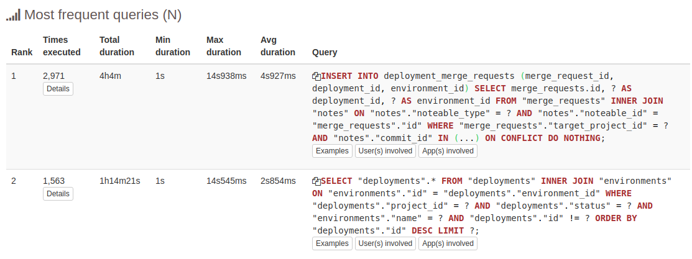
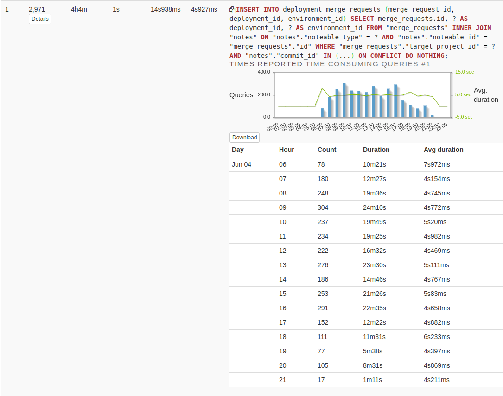
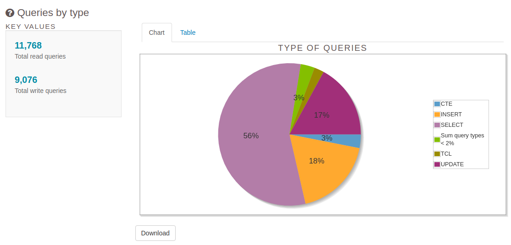
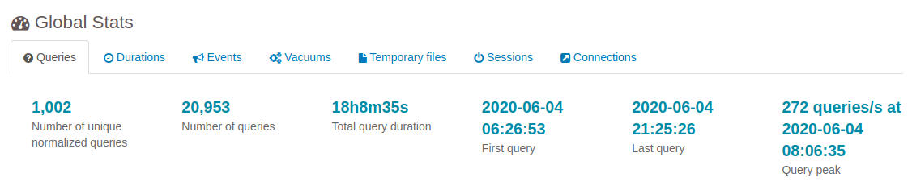
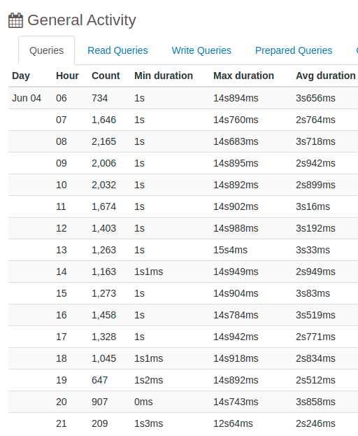
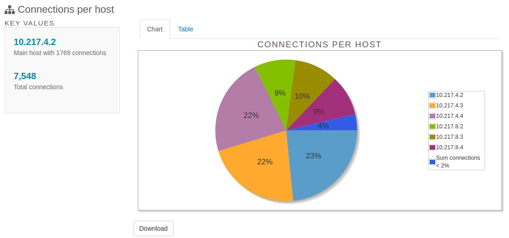
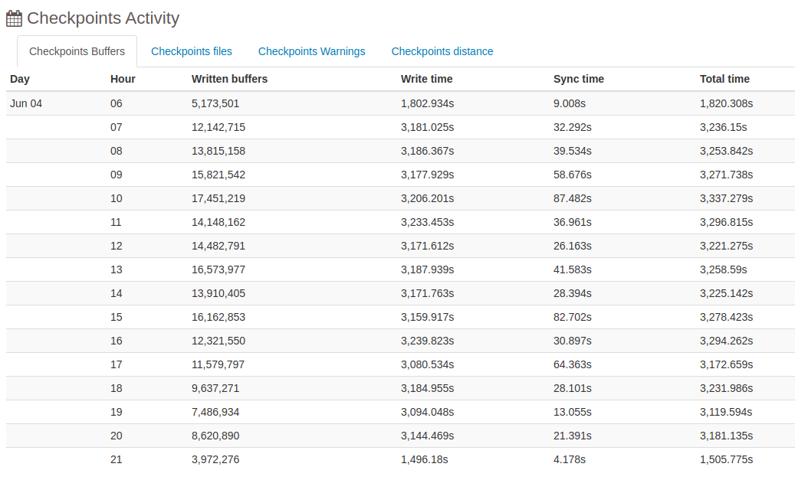
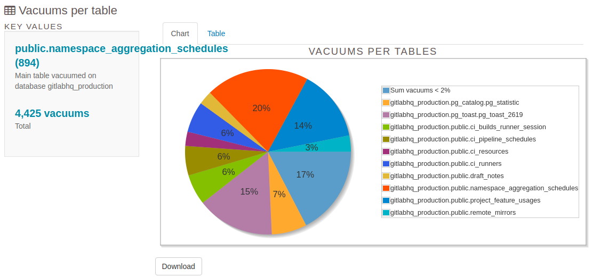
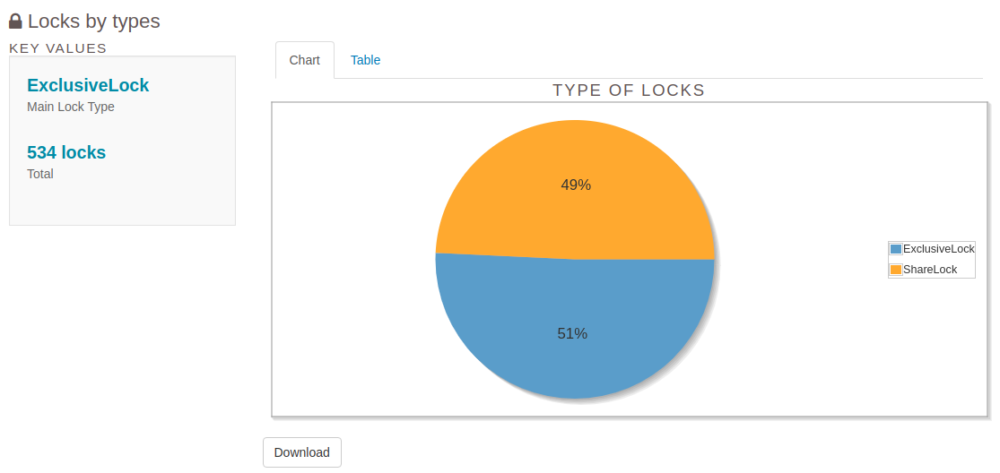
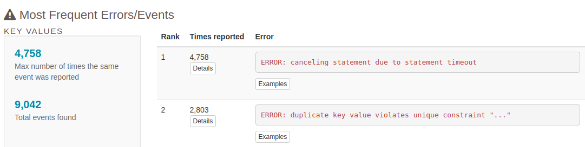

# pgbadger Runbook

## Intro
[pgbadger](https://github.com/darold/pgbadger) is a free  tool that can help to generate a fast interactive HTML report from PostgreSQL's logs, it is very useful when you want to analyze logs with a lot of info. 
The report from pgbadger is about queries (it is always logged when the query time is greater than [log_min_duration_statement](https://postgresqlco.nf/en/doc/param/log_min_duration_statement/) parameter ), connections, vacuum, lock,  errors and others stuff


## Use in GitLab

The first step is to detect the values of two PostgreSQL's parameters, in case of GitLab are the following:

```
show log_destination;
 log_destination 
-----------------
 csvlog
(1 row)

show log_line_prefix;
                   log_line_prefix                   
-----------------------------------------------------
 %m [%p, %x]: [%l-1] user=%u,db=%d,app=%a,client=%h 

```

The following flags of pgbadger to analyze logs are depending on the previous result:

```
--format csv
--prefix '%m [%p, %x]: [%l-1] user=%u,db=%d,app=%a,client=%h'
--csv-separator ','
```

Example of use:
The GitLab postgreSQL's log are located in /var/log/gitlab/postgresql

```
#copy log files from DB server
scp -F ~/.ssh/ssh-file patroni-N-db-gprd.c.gitlab-production.internal:/var/log/gitlab/postgresql/postgresql.cs* .

###If not have permission with your user, can copy to your home and then copy scp command or can streaming via `ssh`:

# zip files (zcat)
 ssh -F ~/.ssh/ssh-file patroni-N-db-gprd.c.gitlab-production.internal "sudo zcat /var/log/gitlab/postgresql/postgresql.csv.3.gz" > postgresql.csv.3
 # plain files (cat)
 ssh -F ~/.ssh/ssh-file patroni-N-db-gprd.c.gitlab-production.internal "sudo cat /var/log/gitlab/postgresql/postgresql.csv" > postgresql.csv

# analyzing 1 log file, but you can analyze more passing the names at the end
pgbadger --format csv --prefix '%m [%p, %x]: [%l-1] user=%u,db=%d,app=%a,client=%h' -o log_report.html --csv-separator ',' postgresql.csv.1

```

The output report will be in html file named `log_report.html`

## The highlighted sections of the report


###  **Queries reports:**

 ### Top 
 The top tab, is one of the most important tabs, and  show the information about slowest queries  found in the logs, see the sections called:
  * Time consuming queries
  * Most frequent queries
  


If make Click the button `Details ` will see more info about this query related with count and duration



 ### Queries
 The Queries tab show the statistical information about queries found in the logs, see the sections called:
  * Queries by type
  * Queries by host



### **General reports**

### Overview
The overview tab shows some general statistical information, see the sections called:

* Global stats 
* General Activity





### Connections
The connections tab shows the graphs about connection information found in the logs, see the sections called:
* Connections per user
* Connections per host




###  **Write reports:**

### Checkpoints
 The checkpoints tab show the statistical information about the checkpoint process found in the logs, see the section called:
  `Checkpoints Activity` 




 ### Vacuums
 The vacuums tab shows the information about VACUUMs and ANALYZEs occurring in the database found in the logs, see the sections called:
  * Analyzes per table 
  * Vacuums per table 
  * Autovacuum Activity




###  **Locks and Events reports:**

 ### locks
 The locks tab show the information about locks occurring in the database found in the logs, see all section here



 ### Events
 The events tab show the anything information no show in another tabs, see the section called:
  *  Most Frequent Errors/Events
  
