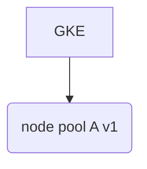
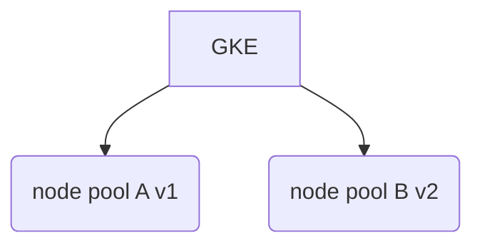

## GitLab.com on Kubernetes

The following is a high level guide on what it takes to build out the necessary
bits for adding GKE and bringing over components of GitLab into Kubernetes.

Our current application configuration components:
* https://gitlab.com/gitlab-com/gl-infra/k8s-workloads/common
* https://gitlab.com/gitlab-com/gl-infra/k8s-workloads/monitoring
* https://gitlab.com/gitlab-com/gl-infra/k8s-workloads/gitlab-com
* https://gitlab.com/gitlab-com/gl-infra/k8s-workloads/gitlab-helmfiles

1. Create the cluster configuration in terraform, we'll need the following
   items:
    * IP address for Cloud NAT
    * Internal IP address for Service running GitLab Container Registry
    * Internal IP address for prometheus service
    * Cloud NAT device
    * Router for the Cloud NAT
    * Cluster - we'll use our gke submodule
      https://gitlab.com/gitlab-com/gl-infra/terraform-modules/google/gke which
      will build out the following items:
      * cluster
      * 1 node pool
      * the required network - subnetwork and secondary networks
    * Logging pubsub instance
    * Create an IAM user for operations on CI/CD and inside of our cluster
    * Example of all the above via terraform:
      https://ops.gitlab.net/gitlab-com/gitlab-com-infrastructure/merge_requests/839
1. Set IAM user permissions on cluster
    * This is manual, documented here:
      https://gitlab.com/gitlab-com/gl-infra/k8s-workloads/gitlab-com/blob/master/README.md#service-account
    * The service account will have an authentication key file in json format
      created, we'll need this for the next step.
1. Set the appropriate environment variables in the application configuration
repos
    * Repos:
      * https://ops.gitlab.net/gitlab-com/gl-infra/k8s-workloads/gitlab-com/-/settings/ci_cd
      * https://ops.gitlab.net/gitlab-com/gl-infra/k8s-workloads/monitoring/-/settings/ci_cd
      * https://ops.gitlab.net/gitlab-com/gl-infra/k8s-workloads/common/-/settings/ci_cd
      * https://ops.gitlab.net/gitlab-com/gl-infra/k8s-workloads/gitlab-helmfiles/-/settings/ci_cd
    * ENV Vars:
      * `SERVICE_KEY`
      * This key is gathered from following the documentation in the previous
        step.
      * This must be added to each repo since environment scoped group level
        variables are not a feature of GitLab
1. Create the application configurations
    * Start by defining a new `environment` in the `gitlab-helmfiles` repo. In particular you will need to add
      the environment to
      * https://gitlab.com/gitlab-com/gl-infra/k8s-workloads/gitlab-helmfiles/-/blob/master/bases/environments.yaml to define
        the new environment and any extra configuration settings for it (such as disabling specific installations)
      * https://gitlab.com/gitlab-com/gl-infra/k8s-workloads/gitlab-helmfiles/-/blob/master/.gitlab-ci.yml to define both a
        job to set some common settings, and the `check`, `diff`, and `apply` jobs for the environment itself
      Note the CI jobs will fail unless the CI settings for the environment have been added to the `gitlab-helmfiles` repo
    * Adjust any necessary configurations or additions by following the README's
      in each of our application configuration repos.
    * Example Merge Requests:
      * Monitoring:
        https://gitlab.com/gitlab-com/gl-infra/k8s-workloads/monitoring/merge_requests/12
      * GitLab.com:
        https://gitlab.com/gitlab-com/gl-infra/k8s-workloads/gitlab-com/merge_requests/5
    * Note that when merged to master, CI/CD will fail, so it would be advised
      to hold off until after the next few steps
1. Take care of any manual actions from our new configuration:
    * https://gitlab.com/gitlab-com/gl-infra/k8s-workloads/monitoring#manual-actions
1. Perform the installation of each of our components
    * To install the base components first from `gitlab-helmfiles` cd into the `gitlab-helmfiles` local checkout
      and run the following
      ```shell
      kubectl config set-context <CONTEXT FOR ENVIRONMENT>
      helmfile -e <ENVIRONMENT> apply
      ```
    * Locally we'll perform the install, `cd` into each of the components' repo
      and then run: `./bin/k-ctl -e <ENVIRONMENT> install`
    * Troubleshoot where necessary
1. We can now merge any commits associated with these repos, and CI/CD should
work successfully
1. Prometheus rules:
    * Inside of our `runbooks` repo, we need to add a configuration inside of
      `.gitlab-ci.yaml` to deploy to our new cluster.
    * ensure the appropriate variables are added to the ops instance
    * Utilize this MR as a guideline:
      https://gitlab.com/gitlab-com/runbooks/merge_requests/1200
1. Create the chef configuration for registry traffic
    * Example Merge Request:
      https://ops.gitlab.net/gitlab-cookbooks/chef-repo/merge_requests/1452
1. Validate the registry is working properly
    * Inside of the haproxy nodes, set the VM's to `MAINT` such that the only
      available registry backend server is our Kubernetes Service endpoint
    * And you should also be able to successfully utilize docker to login, push,
      and pull images
1. Add data source to grafana to our new GKE cluster
    * This is currently done by hand:
      https://gitlab.com/gitlab-com/gl-infra/infrastructure/issues/6955
    * Login as an admin into https://dashboards.gitlab.net
    * Go to Datasources>Add
    * Name: <NAME OF CLUSTER>
    * URL: `http://<IP OF PROMETHEUS SERVICE>:9090` - this is a class A IP
      address as defined by our terraform configs
    * Save and test
1. Add the thanos side cars to our thanos-query ops instance
    * Example MR:
      https://ops.gitlab.net/gitlab-cookbooks/chef-repo/merge_requests/1430

## Monitoring with Kubernetes

### Metrics

We utilize https://gitlab.com/gitlab-com/gl-infra/k8s-workloads/monitoring to
deploy our monitoring infrastructure inside of Kubernetes.

Configuration outside of Kubernetes:
* We add the prometheus endpoint to our thanos-ops query instance.  This is
  handled via the `ops-base` chef role.
* The thanos-query running inside the cluster is added as a datasource to
  grafana.  This is currently done manually.  Though not required, this provides
  a fall back in cases where `thanos-query.ops.gitlab.net` may be unhealthy.

### Logging

A single pubsubbeat VM is setup to monitor a single pubsub that is configured to be a log sink from Stackdriver.  All
items end up in the index `pubsub-gke-inf-<ENV>*`

One can refer to this document for further details
[docs/uncategorized/kubernetes.md](kubernetes.md)

## Terraforming with GKE

* We have our own module: https://ops.gitlab.net/gitlab-com/gl-infra/terraform-modules/google/gke

### Cycling Node Pools

In some cases we may need to upgrade our node pools that participate in a
cluster.  This is a destructive process by default, so we must instead, bring a
new node pool up to prevent an outage.  It would be wise that when a node pool
is to be destroyed, we should play it safe and perform some tasks noted below.

Let's say we want to replace `node pool A` with some change.  We start with
`v1`.  (Nomenclature for visualization purposes)

Existing GKE config - 1 node pool for the GKE cluster



Add new node pool, this will be `v2` - This creates our second node pool for the
GKE cluster



For details on how to migrate workloads from one node pool to a new
one without incurring any service interruption see the
[k8s-gitlab-operations](https://gitlab.com/gitlab-com/runbooks/blob/master/docs/uncategorized/k8s-gitlab-operations.md)
runbook.

### Troubleshooting Terraform

Sometimes Google is doing something to GKE during the time in which we may want
to operate on a cluster.  For example, if you were to create a new node pool,
Google needs to accomplish something.  Sometimes this may be a long running
operation.  And while the Kubernetes Cluster is reachable, serving requests,
Google's API will prevent terraform from making any changes until this process
is complete.  There's a way to figure out what Google is doing.

#### Discovery

Terraform does not _always_ tell you what is going on.  When is doesn't,
terraform will simply timeout when refreshing it's state.  At this point, skip
forward below to figure out what may be happening.  If it does tell you, it'll
look something like this:

```
Error: Error applying plan:

1 error occurred:
        * module.gitlab-gke.google_container_node_pool.node_pool[0] (destroy): 1 error occurred:
        * google_container_node_pool.node_pool.0: Error deleting NodePool: googleapi: Error 400: Operation operation-1565970176782-7753cb1e is currently upgrading cluster gprd-gitlab-gke. Please wait and try again once it is done., failedPrecondition
```

In the above we were provided an `operation id` that we can use.

##### Finding Operations

If we don't know an operation id, we can find one, to figure out what google
might be doing, execute the following:

```
% gcloud container operations list --region us-east1
operation-1565970176782-7753cb1e  UPGRADE_MASTER    us-east1  gprd-gitlab-gke                  DONE     2019-08-16T15:42:56.782819169Z  2019-08-16T15:58:29.249333034Z
operation-1565970176789-257e66be  UPDATE_CLUSTER    us-east1  gprd-gitlab-gke                  DONE     2019-08-16T15:42:56.789869562Z  2019-08-16T15:42:57.01965906Z
operation-1565971458672-ef210c44  DELETE_NODE_POOL  us-east1  node-pool-0                      DONE     2019-08-16T16:04:18.672470053Z  2019-08-16T16:06:52.998278444Z
operation-1565971614556-b7d82560  CREATE_NODE_POOL  us-east1  node-pool-0                      RUNNING  2019-08-16T16:06:54.556307283Z
<snip>
```

Now we have a list of operation id's and we can now further discover what Google
is doing

##### Describing an Operation

If you have an operation id, just plug it in like so:

```
% gcloud container operations describe operation-1565971614556-b7d82560 --region us-east1                                                                                                                 hooman: Fri Aug 16 12:12:43 2019

endTime: '2019-08-16T16:10:33.899860383Z'
name: operation-1565971614556-b7d82560
operationType: CREATE_NODE_POOL
selfLink: https://container.googleapis.com/v1/projects/805818759045/locations/us-east1/operations/operation-1565971614556-b7d82560
startTime: '2019-08-16T16:06:54.556307283Z'
status: RUNNING
targetLink: https://container.googleapis.com/v1/projects/805818759045/locations/us-east1/clusters/gprd-gitlab-gke/nodePools/node-pool-0
zone: us-east1
```

#### Waiting

If you'd like to create an alert so you don't need to wait for progress, you can
utilize the shell in your favor to alert you when an operation is done.
Example:

```
% gcloud container operations wait operation-1565970176782-7753cb1e --region
us-east1 && wall 'operation is done'
```

The above will output that google is waiting with a CLI type spinner.
After which, your desired command to alert you will fire.  In the above example,
`wall` was used.

### Cycling Pods

Due to node pool destructions bringing down nodes before being drained, it would
be wise to do a sweep on the nodes to perform some work to prevent the potential
for outages.

1. Mark the targeted nodes as unschedulable - Example:
```bash
old_node_pool="<name of node pool as defined by terraform>"
for node in $(kubectl get nodes -l cloud.google.com/gke-nodepool=${old_node_pool} -o=name)
do
  kubectl cordon "$node"
  declare node_cordon_exit_code=$?
  if [[ ${node_cordon_exit_code} != 0 ]]
  then
    exit ${node_cordon_exit_code}
  fi
done
```

1. Drain that set of nodes - Example:
```bash
old_node_pool="<name of node pool as defined by terraform>"
for node in $(kubectl get nodes -l cloud.google.com/gke-nodepool=${old_node_pool} -o=name)
do
  kubectl drain --force --ignore-daemonsets --delete-local-data "$node"
  declare node_drain_exit_code=$?
  if [[ ${node_drain_exit_code} != 0 ]]
  then
    exit ${node_drain_exit_code}
  fi
  sleep 60 # don't drain too fast
done
```
1. Perform the terraform destructive process
