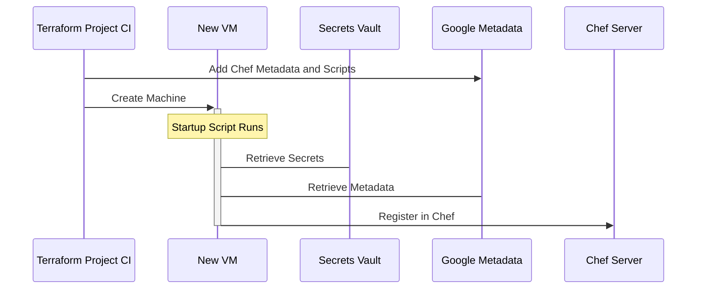

# VM Build Process with Terraform and Chef

1. The Terrafom configuration defines the number, role, and configuration of
   virtual machines that will be built.
1. When the Terraform configuration is applied in order to create a new VM,
   Chef metadata (such as the role, server URL, etc) is added to the instance
   along with a startup script that will run on each boot of the VM.
1. The startup script installs the Chef client, retrieves a Chef key from the
   secure key management system, and boot-straps itself into Chef using the
   provided metadata.
1. The initial, and subsequent, runs of the Chef client will contact the Chef
   server, determine what instructions to apply based on the virtual machine's
   role, and run those instructions locally. These instructions often install
   software, set local configuration information, and deploy secret
   information from key management services into local configurations.

## VM Teardown Process with Terraform and Chef

Note: When a virtual machine is provisioned, a shutdown script that
de-registers the VM from Chef is put in place. This process depends on that
script.

1. The Terraform configuration is adjusted to remove virtual machines and is
   applied.
1. As the virtual machines are stopped, they de-register themselves from Chef
   by way of the shutdown script before being deleted.
