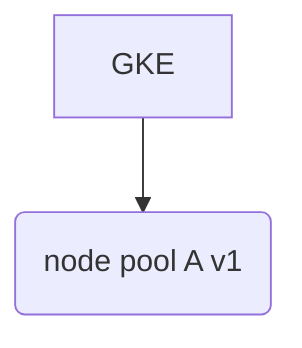
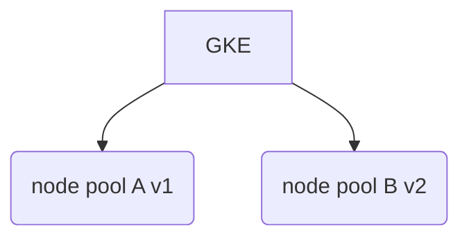
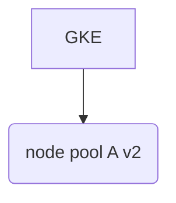

## GitLab.com on Kubernetes

The following is a high level guide on what it takes to build out the necessary
bits for adding GKE and bringing over components of GitLab into Kubernetes.

Our current application configuration components:
* https://gitlab.com/gitlab-com/gl-infra/k8s-workloads/gitlab-com
* https://gitlab.com/gitlab-com/gl-infra/k8s-workloads/monitoring

1. Create the cluster configuration in terraform, we'll need the following
   items:
    * IP address for Cloud NAT
    * Internal IP address for Service running GitLab Container Registry
    * Internal IP address for prometheus service
    * Cloud NAT device
    * Router for the Cloud NAT
    * Cluster - we'll use our gke submodule https://gitlab.com/gitlab-com/gl-infra/terraform-modules/google/gke which will build out the following
      items:
      * cluster
      * 1 node pool
      * the required network - subnetwork and secondary networks
    * Logging pubsub instance
    * Create an IAM user for operations on CI/CD and inside of our cluster
    * Example of all the above via terraform: https://ops.gitlab.net/gitlab-com/gitlab-com-infrastructure/merge_requests/839
1. Set IAM user permissions on cluster
    * This is manual, documented here: https://gitlab.com/gitlab-com/gl-infra/k8s-workloads/gitlab-com/blob/master/README.md#service-account
1. Set the appropriate environment variables in the application configuration repos
    * Repos:
      * https://ops.gitlab.net/gitlab-com/gl-infra/k8s-workloads/gitlab-com/-/settings/ci_cd
      * https://ops.gitlab.net/gitlab-com/gl-infra/k8s-workloads/monitoring/-/settings/ci_cd
      * https://ops.gitlab.net/gitlab-com/gl-infra/k8s-workloads/common/-/settings/ci_cd
    * ENV Vars:
      * `SERVICE_KEY`
1. Create the application configurations
    * Adjust any necessary configurations or additions by following the README's
      in each of our application configuration repos.
    * Example Merge Requests:
      * Monitoring: https://gitlab.com/gitlab-com/gl-infra/k8s-workloads/monitoring/merge_requests/12
      * GitLab.com: https://gitlab.com/gitlab-com/gl-infra/k8s-workloads/gitlab-com/merge_requests/5
    * Note that when merged to master, CI/CD will fail, so it would be advised
      to hold off until after the next few steps
1. Take care of any manual actions from our new configuration:
    * https://gitlab.com/gitlab-com/gl-infra/k8s-workloads/gitlab-com/blob/d8daab846f440d1f0aff63c47c4d1aec62632ce7/HELM_README.md
    * https://gitlab.com/gitlab-com/gl-infra/k8s-workloads/monitoring#manual-actions
1. Perform the installation of each of our components
    * Start off with the common repo first, it contains components required by
      other repos
    * Locally we'll perform the install, `cd` into each of the components' repo
      and then run: `./bin/k-ctl -e <ENVIRONMENT> install`
    * Troubleshoot where necessary
1. We can now merge any commits associated with these repos, and CI/CD should
   work successfully
1. Prometheus rules:
    * Inside of our `runbooks` repo, we need to add a configuration inside of
      `.gitlab-ci.yaml` to deploy to our new cluster.
    * ensure the appropriate variables are added to the ops instance
    * Utilize this MR as a guideline: https://gitlab.com/gitlab-com/runbooks/merge_requests/1200
1. Create the chef configuration for registry traffic
    * Example Merge Request: https://ops.gitlab.net/gitlab-cookbooks/chef-repo/merge_requests/1452
1. Validate the registry is working properly
    * Inside of the haproxy nodes, set the VM's to `MAINT` such that the only
      available registry backend server is our Kubernetes Service endpoint
    * And you should also be able to successfully utilize docker to login, push, and pull images
1. Add data source to grafana to our new GKE cluster
    * This is currently done by hand: https://gitlab.com/gitlab-com/gl-infra/infrastructure/issues/6955
    * Login as an admin into https://dashboards.gitlab.net
    * Go to Datasources>Add
    * Name: <NAME OF CLUSTER>
    * URL: `http://<IP OF PROMETHEUS SERVICE>:9090` - this is a class A IP address as defined by our terraform configs
    * Save and test
1. Add the thanos side cars to our thanos-query ops instance
    * Example MR: https://ops.gitlab.net/gitlab-cookbooks/chef-repo/merge_requests/1430

## Terraforming with GKE

* We have our own module: https://ops.gitlab.net/gitlab-com/gl-infra/terraform-modules/google/gke

### Cycling Node Pools

In some cases we may need to upgrade our node pools that participate in a
cluster.  This is a destructive process by default, so we must instead, bring a
new node pool up to prevent an outage.  It would be wise that when a node pool
is to be destroyed, we should play it safe and perform some tasks noted below.

Let's say we want to replace `node pool A` with some change.  We start with
`v1`.  (Nomenclature for visualization purposes)

Existing GKE config - 1 node pool for the GKE cluster



Add new node pool, this will be `v2` - This creates our second node pool for the
GKE cluster



Change v1 to v2 - This destroys `node pool A`, then creates a new `node pool A`
with the `v2` configuration.


Rid of the extra node pool - This destroys `node pool B`



### Cycling Pods

Due to node pool destructions bringing down nodes before being drained, it would
be wise to do a sweep on the nodes to perform some work to prevent the potential
for outages.

1. Mark the targeted nodes as unschedulable - Example:
```bash
old_node_pool="<name of node pool as defined by terraform>"
for node in $(kubectl get nodes -l cloud.google.com/gke-nodepool=${old_node_pool} -o=name)
do
  kubectl cordon "$node"
  declare node_cordon_exit_code=$?
  if [[ ${node_cordon_exit_code} != 0 ]]
  then
    exit ${node_cordon_exit_code}
  fi
done
```

1. Drain that set of nodes - Example:
```bash
old_node_pool="<name of node pool as defined by terraform>"
for node in $(kubectl get nodes -l cloud.google.com/gke-nodepool=${old_node_pool} -o=name)
do
  kubectl drain --force --ignore-daemonsets --delete-local-data "$node"
  declare node_drain_exit_code=$?
  if [[ ${node_drain_exit_code} != 0 ]]
  then
    exit ${node_drain_exit_code}
  fi
  sleep 60 # don't drain too fast
done
```
1. Perform the terraform destructive process
