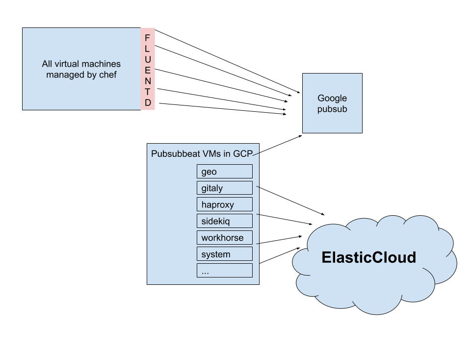

# Application logging at gitlab

## Summary

**https://log.gitlab.net**

### Quick Start

_For information about index names and how they map to log files see the
[table](logging.md#what-are-we-logging) below._

#### Production

To find production logs select the corresponding indexes with `pubsub-*-gprd` in the name

* For azure filter by `json.environment: prd`
* For GCP filter by `json.environment: gprd`

#### Staging

To find production logs select the corresponding indexes with `pubsub-*-gstg` in the name

* For Azure filter by `json.environment: stg`
* For GCP filter by `json.environment: gstg`


#### .org (dev.gitlab.org)

To find .org logs select the corresponding indexes with `pubsub-*-gstg` in the name

* For azure filter by `json.environment: dev`
* For GCP filter by `json.environment: dev`

## Overview

Centralized logging at GitLab uses a combination of FluentD, google pubsub,
and ElasticSearch / Kibana. All logs for the production, staging, gprd and
gstg environments are forwarded to log.gitlab.net.



### What are we logging?

| name | logfile  | type  | index | retention(d) |
| -----| -------- |------ | ----- | --------- |
| gitaly | gitaly/current | JSON | pubsub-gitaly-inf | 1
| pages | gitlab-pages/current | JSON | pubsub-pages-inf | 5
| db.postgres | postgresql/current | line regex | pubsub-postgres-inf | 5
| db.pgbouncer | gitlab/pgbouncer/current | line regex | pubsub-postgres-inf | 5
| workhorse | gitlab/gitlab-workhorse/current | JSON | pubsub-workhorse-inf | 2
| api |gitlab-rails/api\_json.log | JSON | pubsub-api-inf | 5
| geo | gitlab-rails/geo.log | JSON | pubsub-geo-inf | 5
| production (rails) | gitlab-rails/production\_json.log | JSON | pubsub-production-inf | 5
| sidekiq gitlab/sidekiq|cluster/current | JSON | pubsub-sidekiq-inf | 5
| haproxy | /var/log/haproxy.log | syslog | pubsub-haproxy-inf | 1
| system.auth | /var/log/auth.log | syslog | pubsub-system-inf | 5
| system.syslog | /var/log/syslog | syslog | pubsub-system-inf | 5


### FAQ

#### How do I find the right logs for my service?

* Navigate to https://log.gitlab.net
* Select the appropriate index (see chart above).
  * Azure production and GCP production logs are in the *gprd* `*-gprd*` indexes
  * Azure staging and GCP staging logs are in the *gstg* `*-gstg*` indexes
* Optionally filter by environment if you only want to see logs for azure or gcp.
  * `+json.environment: prd` for Azure production
  * `+json.environment: gprd` for Google production

#### A user sees an error on GitLab com, how do I find logs for that user?

* Select the `pubsub-production-inf-grpd*` index
* Search for `+json.username: <user>`

#### Why do we have these annoying json. prefixes?

They are created by https://github.com/GoogleCloudPlatform/pubsubbeat , I don't see a way we can remove them without forking the project.


### Configuration

#### Cookbooks

There are three cookbooks that configure logging on gitlab.com

* gitlab-proxy - Sets up the nginx proxy so that users can access elastic cloud via log.gitlab.net
* gitlab_fluentd - Sets up td-agent on all nodes, forwards logs to pubsub topics.
* gitlab-elk - Sets up the pubsub beat which reads from the topics and forwards to elastic cloud.

#### Role configuration

* There is a [single role for all pubsub beats](https://dev.gitlab.org/cookbooks/chef-repo/blob/master/roles/gprd-infra-pubsub.json) per environment, the index is determined by the hostname which allows it to be dyamic.
* Add  `recipe[gitlab_fluentd::<type>]` to the corresponding role to enable td-agent for the template
* The [ops proxy role](https://dev.gitlab.org/cookbooks/chef-repo/blob/master/roles/ops-infra-log-proxy.json) configures the proxy vm that is the reverse proxy for elastic cloud.


#### Terraform


#### Adding a new logfile

* Decide whether you want a new pubsub topic (which means a new index) or use an existing one
* If you want to use an existing index simply update one of [fluentd templates](https://gitlab.com/gitlab-cookbooks/gitlab_fluentd/tree/master/templates/default) and add a section for the new log.
* If youw ant to create a new index, first modify the `variables.tf` of the `gprd` and `gstg` environment so that there is a new topic and a new pubsubbeat to monitor it.
* Add a new "name" and "machine type", see this example:

```
variable "pubsubbeats" {
  type = "map"

  default = {
    "names"         = ["gitaly", "haproxy", "pages", "postgres", "production", "system", "workhorse", "geo", "sidekiq", "api"]
    "machine_types" = ["n1-standard-8", "n1-standard-8", "n1-standard-4", "n1-standard-4", "n1-standard-8", "n1-standard-8", "n1-standard-8", "n1-standard-4", "n1-standard-8", "n1-standard-4"]
  }
}
```

* Note: try to use a small instance type and increase it if necessary.
* Run terraform
* If you are using a new index you will need to add a [new template to fluentd](https://gitlab.com/gitlab-cookbooks/gitlab_fluentd/tree/master/templates/default).
* After the template is created, add the recipe to the nodes that have the logfile.

### Monitoring and Troubleshooting

* To ensure that pubsub messages are being consumed and sent to elasticsearch see the [stackdriver pubsub dashboards](https://app.google.stackdriver.com/monitoring/1088234/logging-pubsub-in-gprd?project=gitlab-production)
* Monitoring of td-agent (TBD) https://gitlab.com/gitlab-com/migration/issues/390
* Monitoring of pubsub (TBD) https://gitlab.com/gitlab-com/migration/issues/389

#### Logs have stopped showing up on elastic search

* Find the appropriate beat for the index, look for the vm that matches the index name
* SSH to the vm and look at the `/var/log/pubsub/current` logfile to see if there are any errors.
* If there are no errors check out the `/var/log/tg-agent` logfile on one of the nodes sending logs.
