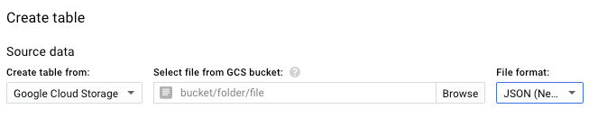
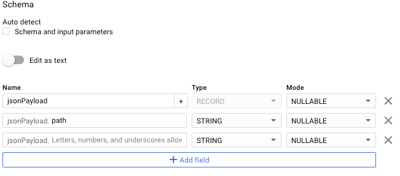
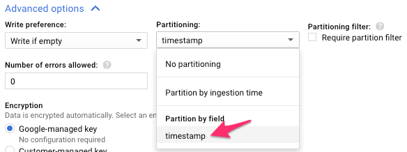

# Loading StackDriver(SD) Archives from Google Cloud Storage (GCS) into BiqQuery

## Summary

Currently searching older logs requires loading line-delimited archive JSON files stored in GCS into another tool; for this we can use Google's BigQuery(BQ).
In order to load a BQ table from a SD produced log archive stored in GCS a dataset must be defined, a table created and data imported through a job using a JSON schema.

### Why


 * You need to query logs older than seven days and thus are no longer in our [ELK](https://log.gitlab.net) instance.
 * You need to query logs older than 30 days and thus are no longer in our SD.
 * You need aggregate operators, summarized reports or output visualizations.

### What

Logs that come in to SD (see [logging.md](logging.md)) are also sent
to GCS in batches using an export sink. After 30 days, the
log messages are expired in SD, but remain in GCS.

# How

## Using the UI

These instructions are similar in both the new style (within `console.cloud.google.com`)
and the old style (external page), but the screen shots may appear with
differing styles.

1. Create a dataset if necessary to group related tables.
2. Click on a control to "Add a new table".
3. Choose "Google Cloud Storage" with "JSON (Newline Delimted)" as the `Source data`.
4. Using the browse functionality to find an appropriate bucket is not always an option, as only buckets in the same project are listed  and data is usually imported from,
    for example, gitlab-production or gitlab-internal. Go to the ["Google Cloud Storage" browser](https://console.cloud.google.com/storage/browser/) and find the data you want to load.
5. Insert the bucket URI as follows: `bucket/folder/folder/myfile.JSON` for a single file or `bucket/folder/folder/*` for all files in that folder. 



4. Unselect "Auto detect Schema and input parameters" if selected.
5. Use one of our [predifined schemas](https://gitlab.com/gitlab-com/runbooks/blob/master/logging_bigquery_schemas/) or do it manually adding records for fields, using `RECORD` type for nested fields and adding
   subfields using the `+` on the parent record.  It should look something like this:



6. In `Advanced options`, check `Ignore unknown values`
7. If the data to be imported is large, consider whether partioning will be necessary.
   1. Add `timestamp` field of type `TIMESTAMP`
   2. In `Advanced options`, select it as the partitioning field:



8. Create the table.  If everything is right, a background job will run to
load the data into the new table. This usually takes a while, be patient or check the status of the created job under "Job History".

## Alternative: Starting from an existing schema

To save time and increase usability, the text version of a table schema can be
dumped with the `bq` command-line tool as follows:

```
  $ bq show --schema --format=prettyjson myproject:myhaproxy.haproxy > haproxy_schema.json 
```

The result can be copied and pasted into BQ by selecting `Edit as text` when creating a table that relies on a similar schema.

Contribute changes or new schemas back to [logging_bigquery_schemas](../logging_bigquery_schemas).

## Example Queries

The following sample queries can be run on tables created for logs coming from `gitlab-gprd-logging-archive/rails-application/*` and conforming to [the rails_application production schema](https://gitlab.com/gitlab-com/runbooks/blob/master/logging_bigquery_schemas/rails_production_schema.json).

### Find the most used Source-IP-Addresses for a User


```
select jsonPayload.remote_ip, count(jsonPayload.remote_ip) as count from dataset.table where jsonPayload.username='SomeUsername' group by jsonPayload.remote_ip
```


### Find Actions by User and respective Paths Performed from a given IP-Address

```
select jsonPayload.action, jsonPayload.username, jsonPayload.path from dataset.table where jsonPayload.remote_ip='SomeIPAdress' and jsonPayload.username='SomeUsername'
```


### Count the Number of Repositories a User has Archived and Downloaded

```
select count(jsonPayload.path) as count from dataset.table where jsonPayload.username like 'SomeUsername' and jsonPayload.action = 'archive'
```

# TODO

 * It's probably possible to perform the above tasks with the `bq` command line.