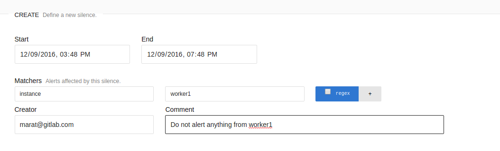
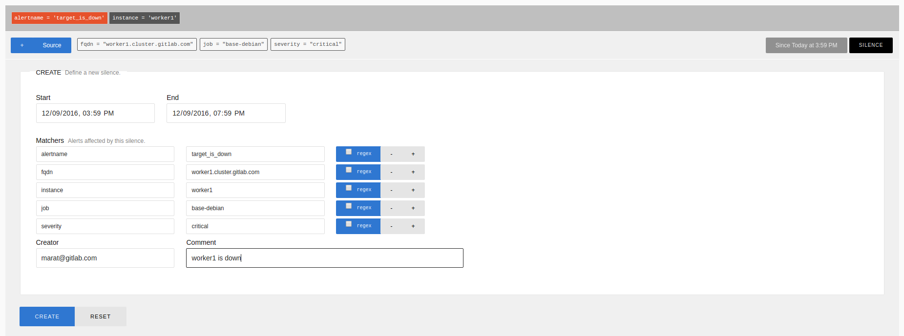

## View alerts

1. Current alerts are being alerted can be viewed on https://alerts.gitlab.com/#/alerts
1. Silenced alerts can be viewed on https://alerts.gitlab.com/#/silences 

## Silence alerts

Silences can be added in two ways:
1. By explicitly creating silence (`New Silence` button) on [silences](https://alerts.gitlab.com/#/silences) page. Enter start, end, creator, reason and condition for silencing.

1. By silencing from [alerts] page. Conditions for silencing automatically taken from alert labels.

1. You can unsilence alert by clicking `Expire` on silence entry.
