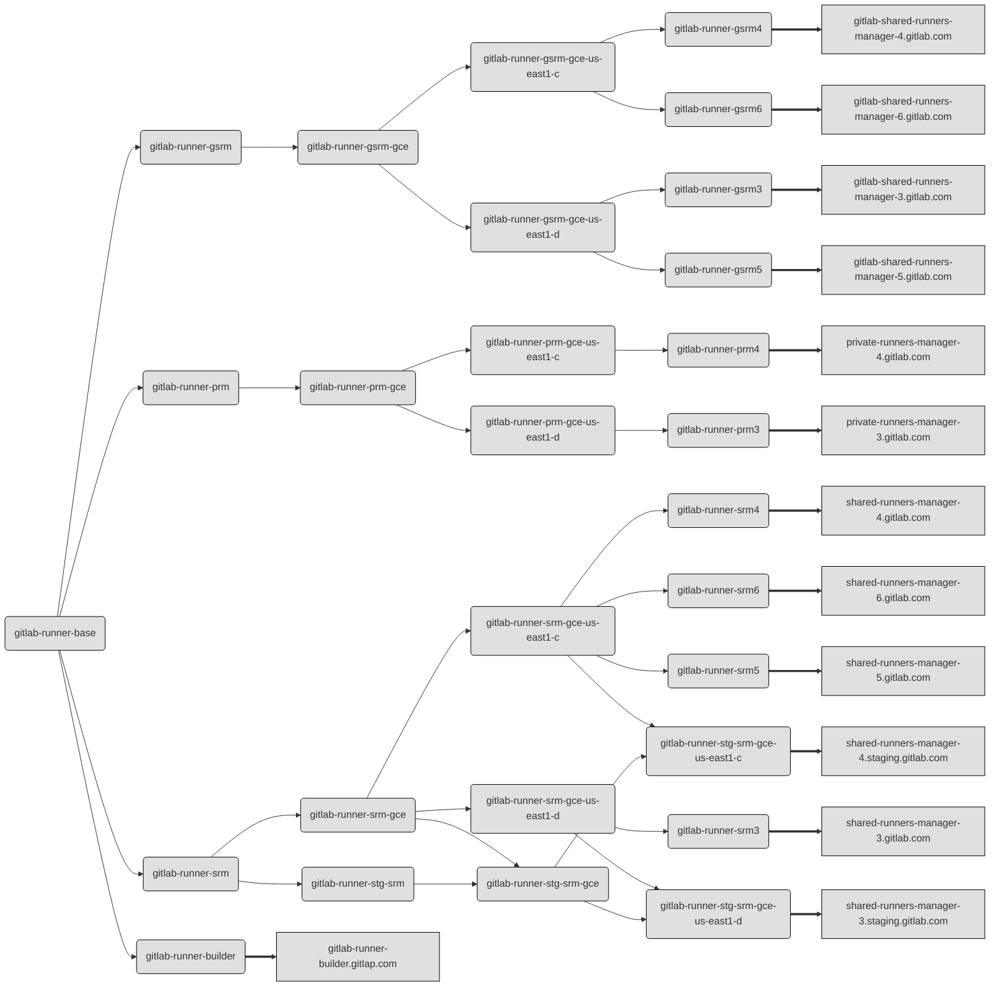

# Update GitLab Runner on runners managers

This runbook describes procedure of upgrading GitLab Runner on our runner managers.

## Roles to runners mapping



## Requirements

To upgrade runners on managers you need to:

- have write access to ops.gitlab.net/gitlab-cookbooks/chef-repo,
- have write access to chef.gitlab.com,
- have configured knife environment,
- have admin access to nodes (sudo access).

## Procedure description

> **Notice**: to make update process transparent for users we should update one runner's host
> at a time. For example GitLab CE project on GitLab.com is using four runners: gitlab-shared-runners-manager-1,
> gitlab-shared-runners-manager-2 (as a shared runners), and both private-runners-manager-X (as specific runners).
>
> If we want to update private-runners-manager-X we should first update private-runners-manager-1, and after this
> update the private-runners-manager-2. It needs to be done like this because of Runner's graceful stop process -
> Runner needs time to finish running builds and during this time it will not handle new builds.
>
> Because of this updating all Runners at once could block jobs processing even for two hours!

1. **Shutdown `chef-client` process on managers being updated**

    For example, to shutdown chef-client on private-runners-manager-X.gitlab.com, you can execute:

    ```bash
    $ knife ssh -aipaddress 'roles:gitlab-runner-prm' -- sudo service chef-client stop
    ```

    To be sure that chef-cilent process is terminated you can execute:

    ```bash
    $ knife ssh -aipaddress 'roles:gitlab-runner-prm' -- 'service chef-client status; ps aux | grep chef'
    ```

    or, since we're using systemd on all Runner machines:

    ```bash
    $ knife ssh -aipaddress 'roles:gitlab-runner-prm' -- systemctl is-active chef-client
    ```

1. **Update chef role (or roles)**

    > **Notice:** This needs to be done only onece if you are updating few nodes using the same role.

    In `chef-repo` directory execute:

    ```bash
    $ rake edit_role[gitlab-runner-prm]
    ```

    where `gitlab-runner-prm` is a role used by nodes that you are updating. Please check the
    [roles to runners mapping section](#roles-to-runners-mapping) to find which role you're interested in.

    In attributes list look for `cookbook-gitlab-runner:gitlab-runner:version` and change it to a version that you want
    to update. It should look like:

    ```json
    "cookbook-gitlab-runner": {
      "gitlab-runner": {
        "repository": "gitlab-runner",
        "version": "10.4.0"
      }
    }
    ```

    If you want to install a Bleeding Edge version of the Runner, you should set the `repository`
    value to `unstable`.

    If you want to install a Stable version of the Runner, you should set the `repository` value to
    `gitlab-runner` (which is a default if the key doesn't exists in configuration).

1. **Upgrade all GitLab Runners**

    To upgrade chosen Runners manager, execute the command:

    ```bash
    $ knife ssh -C1 -aipaddress 'roles:gitlab-runner-prm' -- sudo /root/runner_upgrade.sh
    ```

    This will send a stop signal to the Runner. The process will wait until all handled jobs are finished,
    but no longer than 7200 seconds. The `-C1` flag will make sure that only one node using chosen role
    will be updated at a time.

    When the last job will be finished, or after the 7200 seconds timeout, the process will
    be terminated and the script will:
    - remove all Docker Machines that were created by Runner
      (using the `/root/machines_operations.sh remove-all` script),
    - upgrade Runner and configuration with `chef-client` (which will also start the `chef-client` process
      stopped in the first step of the upgrade process),
    - start Runner's process and check if process is running,
    - show the output of `gitlab-runner --version`.

    When upgrade of the first Runner is done, then continue with another one.

1. **Verify the version of GitLab Runner**

    If you want to check which version of Runner is installed, execute the following command:

    ```bash
    $ knife ssh -aipaddress 'roles:gitlab-runner-prm' -- gitlab-runner --version
    ```

    You can also check the [uptime](https://dashboards.gitlab.net/dashboard/db/ci?refresh=5m&orgId=1&panelId=18&fullscreen)
    and [version](https://dashboards.gitlab.net/dashboard/db/ci?refresh=5m&orgId=1&panelId=12&fullscreen) on
    CI dashboard at https://dashboards.gitlab.net/. Notice that the version table shows versions existing for last 1
    minute so if you check it immediately after upgrading Runner you may see it twice - with old and new version.
    After a minute the old entry should disappear.

1. **Update GitLab.com's configuration description**

    If you are updating shared runners used by GitLab.com, please [create a merge request in GitLab
    CE project][gitlab-ce-new-mr] to update configuration values which are
    specified at https://gitlab.com/gitlab-org/gitlab-ce/blob/master/doc/user/gitlab_com/index.md.

## Upgrade of whole GitLab.com Runners fleet

We're in the process of refactorizing configuration of GitLab.com's Runners. Currently, if you want to update
the version on all Runners, it's easiest to edit `gitlab-runner-base` role. If you want to update only selected
Runner, then you should edit a related role, and set chosen version with `override_attributes`.

If you want to upgrade all Runners of GitLab.com fleet at the same time, then you can use the following script:

```bash
# Stop chef-client
knife ssh -aipaddress 'roles:gitlab-runner-base' -- sudo service chef-client stop
knife ssh -aipaddress 'roles:gitlab-runner-base' -- systemctl is-active chef-client

# Update configuration in roles definition and secrets
git checkout master && git pull
git checkout -b update-runners-fleet
$EDITOR roles/gitlab-runner-base.json
git add roles/gitlab-runner-base.json && git commit -m "Update runners fleet to [X.Y.Z-...]"
git push -u origin update-runners-fleet
```

When the push will be finished - use the printed URL to open an MR. Double check if the
changes are doing what it should be done for the deployment, and set 'Merge when pipeline succeeds'.
After the branch will be merged, open the pipeline FOR THE MERGE COMMIT (search at https://ops.gitlab.net/gitlab-cookbooks/chef-repo/pipelines/)
and check in the `apply_to_staging` job, if the dry-run tries to upload only the role file updated above.
If yes - hit `play` on the `apply_to_prod` job and wait until the job on Chef Server will be updated.

You can continue **after the changes are uploaded to CHef Server**.

```bash
# Upgrade Runner's version and configuration on nodes
knife ssh -C1 -aipaddress 'roles:gitlab-runner-builder' -- sudo /root/runner_upgrade.sh &
knife ssh -C1 -aipaddress 'roles:gitlab-runner-gsrm' -- sudo /root/runner_upgrade.sh &
knife ssh -C1 -aipaddress 'roles:gitlab-runner-prm' -- sudo /root/runner_upgrade.sh &
knife ssh -C1 -aipaddress 'roles:gitlab-runner-srm' -- sudo /root/runner_upgrade.sh &
time wait
```

> **NOTICE:**
Be aware, that graceful restart of whole CI Runners fleet may take up to several hours!
6-8 hours is the usual timing. Until we'll finish our plan to
[use K8S to deploy Runner Managers][k8s-deployment] anyone that needs to update/restart
Runner on our CI fleet should expect, that the operation will be **really long**.

[gitlab-ce-new-mr]: https://gitlab.com/gitlab-org/gitlab-ce/merge_requests/new
[k8s-deployment]: https://gitlab.com/gitlab-com/gl-infra/infrastructure/issues/4813

