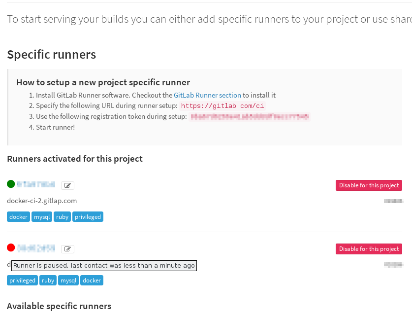

# Update GitLab Runner on runners managers

This runbook describes procedure of upgrading GitLab Runner on our runner managers:

- docker-ci-1.gitlap.com
- docker-ci-2.gitlap.com
- shared-runners-manager-1.gitlab.com
- shared-runners-manager-2.gitlab.com
- omnibus-builder-runners-manager.gitlab.org

## Requirements

To upgrade runners on managers you need to:

- have write access to dev.gitlab.org/cookbooks/chef-repo,
- have write access to chef.gitlab.com,
- have configured knife environment,
- have admin access to nodes (sudo access),
- have admin access to GitLab each instance connected with updated runner (for updating shared runners) **OR**
- have master access to at least one project connected with a specific runner on each GitLab instance
  where runner is used.

## Procedure

> **Notice**: to make update process transparent for users we should update one runner's host
> at a time. For example GitLab CE project on GitLab.com is using four runners: both shared-runners-manager-X
> (as a shared runners), and both docker-ci-X (as specific runners).
>
> If we want to update docker-ci-X we should first update docker-ci-1, and after this update the docker-ci-2.
> It needs to be done like this because of pausing runner - for a time needed to finish running builds the
> runner will not handle new builds.

1. **Shutdown `chef-client` process on managers beeing updated**

    For example, to shutdown chef-client on docker-ci-X.gitlap.com, you can execute:

    ```bash
    $ knife ssh -aipaddress 'role:gitlab-private-runners' -- sudo service chef-client stop
    ```

    To be sure that chef-cilent process is terminated you can execute:

    ```bash
    $ knife ssh -aipaddress 'role:gitlab-private-runners' -- "service chef-client status; ps aux | grep chef"
    ```

1. **Pause first runner in GitLab instance (or instances)**

   _If you have admin access_

   - go to admin/runners page, e.g. https://gitlab.com/admin/runners
   - enter runner's name **or** runner's token in search field and click `Search` button,
   - find your runner on the list and click `Pause` button.

   _If you don't have admin access and it's a specific runner_

   - go to the project's runners page, e.g. https://gitlab.com/gitlab-org/gitlab-ce/runners
   - find a runner you want to pause and click the _edit_ button
   - unmark `active` checkbox and save changes
   - go again to the project's runners page and check runner's status. Icon on the left should
     change to a red circle and it should show _'Runner is paused, ...'_ title on mouseover.

     

   _If you don't have admin access and it's a shared runner_

   You have a little problem. To pause shared runner you need to be a GitLab admin. You should ask
   someone to give you admin access **OR** find someone with admin access who can pause the runner
   for you.

   Remember that the runner will be unpaused at the end of the procedure. If you are asking someone
   to pause runner for you, make sure that someone will be available to unpause it later.

1. **Send `SIGQUIT` to Runner's process on first node**

    - ssh do the host - e.g. `$ ssh docker-ci-1.gitlap.com`,
    - find the PID of the process

        ```bash
        $ ps aux | grep gitlab
        root     13748 16.9  3.1 219344 111976 ?       Ssl  Jul18 502:44 /usr/bin/gitlab-ci-multi-runner run --working-directory /home/gitlab-runner --config /etc/gitlab-runner/config.toml --service gitlab-runner --syslog --user gitlab-runner
        ```
    - send `SIGQUIT` signall

        ```bash
        $ sudo kill -SIGQUIT 13748
        ```
    - look on logs to see when process will be restarted

        ```bash
        $ sudo tail -f /var/log/upstart/gitlab-runner.log -n 100
        ```

        You should see a line like `WARN[177812] Requested quit, waiting for builds to finish  builds=6`. This
        means that runner received `SIGQUIT` signall and from now on it's not handling new builds, it's letting
        running builds to be finished and after this it will be finished.

        Upstart will automatically restart the process so we are waiting to a log output like (this may take a long
        while):

        ```
        INFO[183600] All workers stopped. Can exit now             builds=0
        INFO[0000] Starting multi-runner from /etc/gitlab-runner/config.toml ...  builds=0
        INFO[0000] Running in system-mode.
        INFO[0000]
        INFO[0000] Config loaded: concurrent: 200
        checkinterval: 4
        (...)
          builds=0
        ```

    > **Notice:** While waiting you can go to the next point.

1. **Update chef role (or roles)**

    > **Notice:** This needs to be done only onece if you are updating few nodes using the same role.

    While waiting for process to be terminated we can update role (or roles) configuration to set a new
    version of a runner.

    In `chef-repo` directory execute:

    ```bash
    $ rake edit_role[gitlab-private-runners]
    ```

    where `gitlab-private-runners` is a role used by nodes that you are updating. It will be `gitlab-private-runners`
    for docker-ci-X.gitlap.com or `gitlab-shared-runners` for shared-runners-manager-X.gitlab.com.

    For omnibus-builder-runers-manager.gitlab.com you should edit `omnibus-builder-runners-manager` role's secrets:

    ```bash
    $ rake edit_role_secrets[omnibus-builder-runners-manager,_default]
    ```

    In attributes list look for `cookbook-gitlab-runner:gitlab-runner:version` and change it to a version that you want
    to update. It should look like:

    ```json
    "cookbook-gitlab-runner": {
      "chef-vault" : "gitlab-private-runners",
      "gitlab-runner": {
        "repository": "unstable",
        "version": "1.4.0~beta.77.g0ac09d5"
      }
    }
    ```

    If you want to install a Bleeding Edge version of the Runner, you should set the `repository` value to `unstable`.
    If you want to install a Stable version of the Runner, you should set the `repository` value to
    `gitlab-ci-multi-runner` (which is a default if the key doesn't exists in configuration).

1. **Start `chef-client` process on a node**

    If old process finished all builds (and was restarted by upstart) you can restart `chef-client` on the node.

    ```bash
    $ sudo service chef-client start
    ```

    You can check if the process is runing by:

    ```bash
    $ service chef-client status; ps aux | grep chef-client
    ```

    Chef-client in next half of hour should update all configuration. After this time you can check if the runner
    was updated:

    ```bash
    $ gitlab-runner --version
    Version:      1.4.0~beta.77.g0ac09d5
    Git revision: 0ac09d5
    Git branch:   master
    GO version:   go1.6.3
    Built:        Wed, 20 Jul 2016 14:44:37 +0000
    OS/Arch:      linux/amd64
    ```

    If you don't want to wait for chef-client process to update configuration, you can run chef-client by hand
    **after you've started the process**, by executing:

    ```bash
    $ sudo chef-client
    ```

1. **Unpause runner in GitLab instance (instances)**

    Regarding which type of access do you have:
    - unpause runner using `admin/runners` page and `Unpause` button,
    - unpause runner using project's runners page -> edit -> _active_ checkbox (should be makred to activate),
    - ask someone with admin access to gitlab to unpause the runner.

1. **Repeat procedure for other nodes**

    If you are updating few nodes (e.g. docker-ci-X.gitlap.com) you should repeat points 2., 3., 5., 6. for each
    next node. There is no need to repeat 1. (you've stopped `chef-client` process on all nodes at once) and no need
    to repeat 4. (you need to update role configuration only once).
