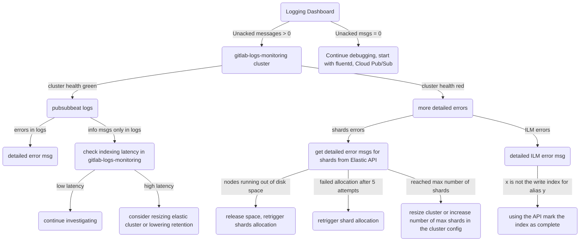

<!-- START doctoc generated TOC please keep comment here to allow auto update -->
<!-- DON'T EDIT THIS SECTION, INSTEAD RE-RUN doctoc TO UPDATE -->
**Table of Contents**  *generated with [DocToc](https://github.com/thlorenz/doctoc)*

- [Troubleshooting](#troubleshooting)
    - [Overall health (there's something broken with logging but you don't know what)](#overall-health-theres-something-broken-with-logging-but-you-dont-know-what)
    - [Fluentd](#fluentd)
    - [PubSub](#pubsub)
    - [pubsubbeat](#pubsubbeat)
    - [Elastic](#elastic)
    - [Index Lifecycle Management (ILM)](#index-lifecycle-management-ilm)
- [Failover and Recovery procedures](#failover-and-recovery-procedures)
    - [Fluentd](#fluentd-1)
    - [PubSub](#pubsub-1)
        - [Acknowledge all messages in a queue](#acknowledge-all-messages-in-a-queue)
    - [pubsubbeat](#pubsubbeat-1)
    - [Elastic](#elastic-1)
    - [Index Lifecycle Management (ILM)](#index-lifecycle-management-ilm-1)

<!-- END doctoc generated TOC please keep comment here to allow auto update -->

# Troubleshooting

## Overall health (there's something broken with logging but you don't know what)

1. Go to the [Logging Dashboard](https://dashboards.gitlab.net/d/USVj3qHmk/logging?orgId=1&from=now-7d&to=now).
1. If the number of unacked messages is other than 0, than it *most likely* means that everything is fine with infrastructure up to pubsubbeat (fluentd is sending logs, Cloud Pub/Sub is receiving and queueing them, but they are not pulled from the queue by the pubsubbeat).
1. Go to the Elastic monitoring cluster to check the health of the Elastic logging cluster. If the logging cluster is fine than there's probably something wrong with pubsubbeat.

here's an example of how a debugging process might look like:

## Fluentd

- monitoring of td-agent  https://gitlab.com/gitlab-com/migration/issues/390
- check fluentd logs for errors:
  - check `./gitlab-fluentd/attributes/default.rb` for location of the logs
  - ssh to the VM which you suspect to be not sending logs
  - check logs for errors

## PubSub

- monitoring of pubsub https://gitlab.com/gitlab-com/migration/issues/389
- to ensure that pubsub messages are being consumed and sent to elasticsearch see the [stackdriver pubsub dashboards](https://app.google.stackdriver.com/monitoring/1088234/logging-pubsub-in-gprd?project=gitlab-production)
- check Grafana logging dashboard
  - if the number of unacked messages is going up, it means the problem is with taking messages out of the queue
- check in StackDriver for logs related to: pubsub, pubsub topic, pubsub subscription
- pubsub monitoring graphs in Google console

## pubsubbeat

- check status of the pubsubbeat process:
  - ssh to the pubsub VM which you suspect to be not sending logs
  - check service status: `sv status pubsubbeat`
  - check the process is running, e.g. `ps aux | grep pubsubbeat`
- check logs for errors:
    - check `./gitlab-elk/attributes/default.rb` for location of the logs
    - check logs for errors, most likely available at `/var/log/pubsubbeat/current`
- check cpu usage on the VM

## Elastic

for Elastic troubleshooting procedures see (./elastic/doc/troubleshooting/README.md)[../../../elastic/doc/troubleshooting/README.md]

## Index Lifecycle Management (ILM)

for ILM troubleshooting procedures see (./elastic/doc/troubleshooting/README.md)[../../../elastic/doc/troubleshooting/README.md]

# Failover and Recovery procedures #

## Fluentd ##

## PubSub ##

### Acknowledge all messages in a queue

Acknowleding all messages currently in the queue is a destructive action (all logs in the queue will be lost!).

`gcloud beta pubsub subscriptions seek <subscription_name> --time=$(date +%Y-%m-%dT%H:%M:%S)`

https://cloud.google.com/pubsub/docs/replay-overview

## pubsubbeat ##

- restart pubsubbeat:
  - `sv status pubsubbeat`   # see how long it's been running
  - `sv restart pubsubbeat`
  - `sv status pubsubbeat`   # see how long it's been running
- stop pubsubbeat:
  - `sv status pubsubbeat`
  - `sv stop pubsubbeat`
  - `sv status pubsubbeat`
  - if it's still running:
    - it might actually still be shutting down gracefuly, for example waiting until all uploads to ES are finished, check logs
    - if it's not doing anything or you absolutely have to kill it now: `kill -9 <pubsubbeat_pid>` PLEASE BE SUPER CAREFUL WITH THIS COMMAND AND ONLY USE IF YOU HAVE NO OTHER CHOICE!

## Elastic

for Elastic recovery procedures see [./elastic/doc/troubleshooting/README.md](../../../elastic/doc/troubleshooting/README.md)

## Index Lifecycle Management (ILM)

for ILM recovery procedures see [./elastic/doc/troubleshooting/README.md](../../../elastic/doc/troubleshooting/README.md)
