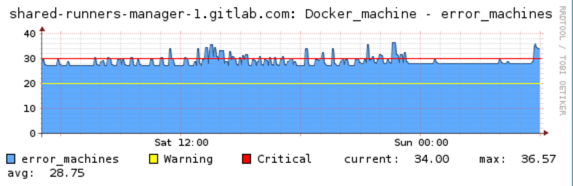

# CI runner manager report a high number of errors

## Symptoms

* Check MK links
    1. [shared-runners-manager-1.gitlab.com](https://checkmk.gitlap.com/gitlab/check_mk/index.py?start_url=%2Fgitlab%2Fpnp4nagios%2Findex.php%2Fgraph%3F%26host%3Dshared-runners-manager-1.gitlab.com%26srv%3DDocker_machine%26source%3D1%26theme%3Dmultisite%26baseurl%3D%2Fgitlab%2Fcheck_mk%2F)
    2. [shared-runners-manager-2.gitlab.com](https://checkmk.gitlap.com/gitlab/check_mk/index.py?start_url=%2Fgitlab%2Fpnp4nagios%2Findex.php%2Fgraph%3F%26host%3Dshared-runners-manager-2.gitlab.com%26srv%3DDocker_machine%26source%3D0%26theme%3Dmultisite%26baseurl%3D%2Fgitlab%2Fcheck_mk%2F)
    3. [docker-ci-1.gitlap.com](https://checkmk.gitlap.com/gitlab/check_mk/index.py?start_url=%2Fgitlab%2Fpnp4nagios%2Findex.php%2Fgraph%3Fhost%3Ddocker-ci-1.gitlap.com%26srv%3DDocker_machine%26theme%3Dmultisite%26baseurl%3D..%2Fcheck_mk%2F)
    4. [docker-ci-2.gitlap.com](https://checkmk.gitlap.com/gitlab/check_mk/index.py?start_url=%2Fgitlab%2Fpnp4nagios%2Findex.php%2Fgraph%3Fhost%3Ddocker-ci-2.gitlap.com%26srv%3DDocker_machine%26theme%3Dmultisite%26baseurl%3D..%2Fcheck_mk%2F)
* Increase in docker_machine errors over 30.

    

* Message in alerts channel:
    * *shared-runners-manager-[1-2].gitlab.com service Docker_machine is CRITICAL*
    * *docker-ci-[1-2].gitlap.com service Docker_machine is CRITICAL*

## Possible checks

1. Check DigitalOcean status on Twitter: [@DOStatus](https://twitter.com/DOStatus).

1. SSH into the machine having issues. For example:

    ```bash
    $ ssh shared-runners-manager-1.gitlab.com
    ```

1. Check the status of machines:

    ```bash
    $ sudo su
    # /root/machines_operations.sh list
    # /root/machines_operations.sh count
    ```

1. You can also do a check using Docker Machine:

    > **Notice:**
    > `docker-machine ls` is doing an API call for each machine configured on the host. This will increase the
    > DigitalOcean Token Rate Limits usage. Please use this command carefully and consider to skip this step if
    > `DO_TOKEN_RATE_LIMITS` service for this host in Check MK is also _WARNING_ or _CRITICAL_.

    ```bash
    $ sudo su
    # docker-machine ls
    ```

    Save this output for later troubleshooting.

1. Check logs in `/var/log/upstart/gitlab-runner.log`.

## Resolution

1. Remove the failing machines via the `machines_operations.sh` script:

    > **Notice:**
    > Below command can also remove machines that were created recently and didn't received
    > a `DropletID` value yet. We should update the script to remove only machines marked as
    > `FAILING` which are created more than 2 minutes ago (or less/more?).

    ```bash
    $ sudo su
    # /root/machines_operations.sh remove-failing
    ```

1. Do a cross-check of machines on DigitalOcean and remove machines that are no longer managed
   by the host.

    > **Notice:**
    > We need a script for this!

## Post checks

1. Check the status of machines:

    ```bash
    $ sudo su
    # /root/machines_operations.sh list
    # /root/machines_operations.sh count
    ```

    Number of machines in `FAILING` state should be less than 20-30.

1. Check MK - `Docker_machine` service should be back to normal
