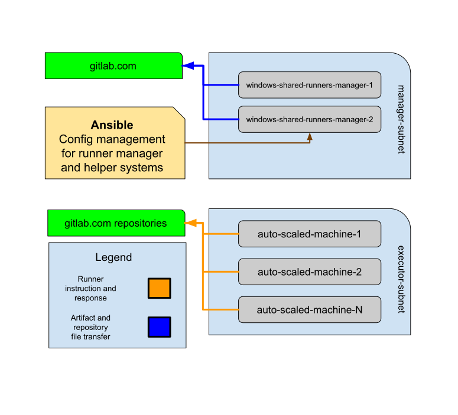

# Windows Autoscaling Runners

We operate 2 runner manager servers that run Windows and build Windows shared runners. We
must use Windows as the manager and executors talk via WinRM. However, the data flow
of the Windows runners managers are the same as the Linux runner described in
[the README](../README.md). We use a [custom autoscaler](https://gitlab.com/gitlab-org/ci-cd/custom-executor-drivers/autoscaler)
instead of `docker-machine` for these Windows runners. There is an architecture diagram that
can be found in [architecture.md](./architecture.md)

## Windows Configurations

We manage configurations of Windows servers in our [ci-infrastructure-windows](https://ops.gitlab.net/gitlab-com/gl-infra/ci-infrastructure-windows)
project. In there you will find an `ansible` directory which includes ansible playbooks and roles
used to configure the servers. Additionally, there is a `packer` directory which is used to build
images for the Windows managers. For now, we aren't doing too much with Packer as we don't have
a way to properly rebuild servers without downtime.

The Windows managers use a [custom image](https://gitlab.com/gitlab-org/ci-cd/shared-runners/images/gcp/windows-containers/)
built with Packer to build the machines that execute jobs.

## Connecting to Windows

Please read the [connecting to Windows](./connecting.md) documentation
to install relevant software and connect to Windows.

## Tools

### Powershell

[Powershell](https://docs.microsoft.com/en-us/powershell/) is the preferred method
of interacting with Windows via command line. While Powershell is very complex and
powerful, below are some common commands you might use. Please note that as with
most things Windows, these commands are not case-sensitive. You may also be interested
in reading Ryan Palo's [PowerShell Tutorial](https://simpleprogrammer.com/powershell-tutorial/)
as it is written with those who hate PowerShell in mind and helps relate it to
more familiar `bash` commands.

1. `Get-Content` is a tool similar to `head`, `tail`, and `cat` on Linux. 
   1. Ex. `Get-Content -Path .\logfile.log -TotalCount 5` will get the first 5 lines of a file.
   2. Ex. `Get-Content -Path .\logfile.log -Tail 5 -Wait` will get the last 5 lines of a file AND follow it for any changes.
   3. [`Get-Content` documentation](https://docs.microsoft.com/en-us/powershell/module/microsoft.powershell.management/get-content?view=powershell-7)

### Third party tools

There are a few tools that are currently installed on each manager during setup. These are:

- [Notepad++](https://notepad-plus-plus.org/)
- [vim](https://chocolatey.org/packages/vim)
- jq
- [Process Explorer](https://docs.microsoft.com/en-us/sysinternals/downloads/process-explorer)
- [cmder](https://cmder.net/)

Process Explorer is probably the most important software listed. It is a great tool that gives
incredibly detailed information on processes, and it is substantially better than the built in
task manager. If you need to find out info on any processes, you should use this instead.

Additionally, `cmder` is an easier to use terminal emulator.

## Troubleshooting

### Shared Runners Manager Offline

If a shared runners manager is [shown offline](https://gitlab.com/gitlab-com/gl-infra/infrastructure/issues/9186):

- connect to the manager:
  - `sft rdp --via lb-bastion.windows-ci.gitlab.com windows-shared-runners-manager-1`
- start powershell as _admin_ (right click on powershell -> "start as Admin")
- in powershell:

```
C:\Gitlab-Runner\gitlab-runner.exe status

# if down:
C:\Gitlab-Runner\gitlab-runner.exe start
```

### Autoscaler Logs and Docs

The autoscaler is a [custom executor](https://docs.gitlab.com/runner/executors/custom.html) plugin
for the GitLab Runner.

The autoscaler logs to a file located at `C:\GitLab-Runner\autoscaler\autoscaler.log`. This file
will contain all the information regarding creation, connection, and deletion of VMs. You may want to look
here if VM creation is failing or connections from the managers are failing. This is likely
the best first place to check when issues arise.

### Firewall rules for winrm

The managers must be able to connect to the spawned VMs via port 5985-5986.
The relevant GCP firewall rules are defined in [firewall.tf](https://ops.gitlab.net/gitlab-com/gitlab-com-infrastructure/-/blob/master/environments/windows-ci/firewall.tf#L15-30)
in our terraform repo. The port should be open by default on the spawned
VMs during [packer image creation](https://gitlab.com/gitlab-org/ci-cd/shared-runners/images/gcp/windows-containers/-/blob/master/packer.json#L28-31).

### Using the wrong image, with missing dependencies

The image that the spawned VMs use is created by the [windows-container](https://gitlab.com/gitlab-org/ci-cd/shared-runners/images/gcp/windows-containers)
project and defined in the [group_vars](https://ops.gitlab.net/gitlab-com/gl-infra/ci-infrastructure-windows/-/blob/master/ansible/group_vars/gcp_role_runner_manager.yml#L48)
in Ansible.

## Architecture Diagram


