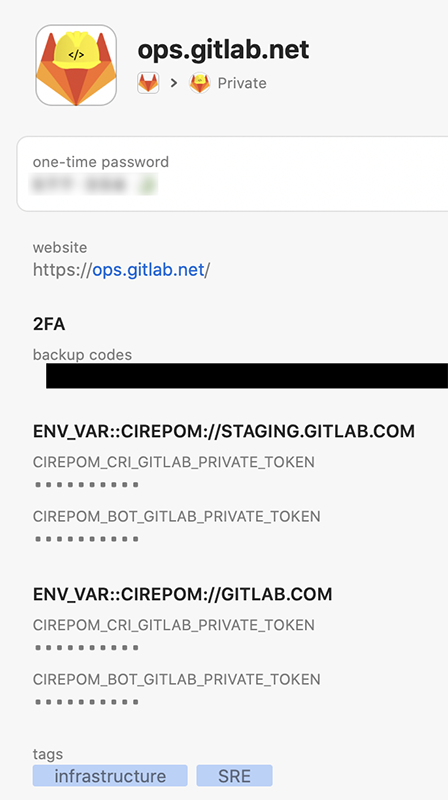

# Environment Variables on Local Shells

Whenever we need to use enviornment variables in a local shell, it is good practice to avoid writing them anywhere on disk, whether on shell initialization files, configuration files or even ephemeral files. Cutting and pasting is also cumbersome and prone to error.

The following method allows you to set environment variables safely (where *safe* in this context means "*as much as you trust 1Password*") on local shells (i.e., your laptop), possibly on demand, through the use of 3 utilities: 

* [`op`](https://1password.com/downloads/command-line/), the official 1Password CLI tool
* [`jq`](https://stedolan.github.io/jq/download/), a lightweight and flexible command-line JSON processor
* [`direnv`](https://direnv.net), a shell extension that loads and unloads environment variables depending on the current directory

### Context

While developing [CIrepoM](https://gitlab.com/gitlab-com/gl-infra/cirepom), I found it necessary to tinker with my shell environment often to set the correct variables to run the tool and also to mimic the behavior under pipelines and ensure credentials were properly stowed away. As I did not relish constantly cutting and pasting or storing these on disk, I wanted a method that used existing tools to setup the environment safely.


## Installation

Install the utilities via your favorite method:

```
# brew install homebrew/cask/1password-cli
# brew install jq
# brew install direnv
```


## Initializing 1Password-CLI: `op`

Much like the 1Password app, its CLI counterpart needs to be [initialized](https://support.1password.com/command-line-getting-started/#get-started-with-the-command-line-tool), which requires your **Secrey Key** (you can find it in your 1Password Emergency Kit or in the 1Password App, under Preferences > Accounts tab).

```
you@your_laptop:~:op signin gitlab.1password.com <YOUR_EMAIL_ADDRESS>
Enter the Secret Key for <YOUR_EMAIL_ADDRESS> at gitlab.1password.com: <YOUR_SECRET_KEY>
Enter the password for <YOUR_EMAIL_ADDRESS> at gitlab.1password.com:  <YOUR_PASSWORD>
Enter your six-digit authentication code: <YOUR_2FA_CODE>
export OP_SESSION_gitlab="<YOUR_SESSION_TOKEN>"
# This command is meant to be used with your shell's eval function.
# Run 'eval $(op signin gitlab)' to sign in to your 1Password account.
# Use the --raw flag to only output the session token.
```

This is a one-time step to register your device. From this point on, `eval` the `op siging` command to get your session token in your environment, maybe in your shell's rc files or some other convenient spot. Note that once your device has been initialized, you only need to use the account *alias* (it defaults to the account's subdomain, `gitlab` above) and that the token will time out after 30 minutes of inactivity.

```
you@your_laptop:~:op signin gitlab
```


## Using `op`

You can now start using the `op` utility to query 1Password. From here on, I'll be using samples from my own shell working with CIrepoM:

```
Last login: Wed Mar 18 13:29:09 on ttys017
gerir@beirut:~:onep login
Enter the password for glopezfernandez@gitlab.com at gitlab.1password.com: <PASSWORD>

gerir@beirut:~:env | grep OP_SESSION_gitlab
OP_SESSION_gitlab=<YOUR_SESSION_TOKEN>
```

To use CIrepoM, the first step is to use the `botload` action to load repository sets into the `cirepom-bot` repository, which requires two API tokens: one to open a CR in the Production queue (on GitLab.com) and one to create runset branches in the bot repository (which is hosted on `ops.gitlab.net`). I keep these tokens in 1Password:

<div align="center">




</div>

The are many ways in which we can hook into this record through the CLI. For my purposes, and to add some generic indirection when these are setup later with `direnv`, I chose to use the UUID for the item rather than a *friendlier* search, since these will be set on `envrc` files and will not change unless I were to delete the item.

First, let's find this item's UUID:

```
gerir@beirut:~:op list items --vault Private | jq ' .[] | select(.overview.title == "ops.gitlab.net") | .uuid'
"5r4j2rlgdbbsrbxifm5gcebai4"
```

Let's now look at this entity in detail (sensitive values have been scrubbed):

```
gerir@beirut:~:op get item 5r4j2rlgdbbsrbxifm5gcebai4 | jq ' .[]'
{
  "fields": [
    {
      "designation": "username",
      "name": "username",
      "type": "T",
      "value": ""
    }
  ],
  "notesPlain": "",
  "passwordHistory": [],
  "sections": [
    {
      "name": "linked items",
      "title": "Related Items"
    },
    {
      "fields": [
        {
          "k": "concealed",
          "n": "TOTP_91FEC9FFBDEE4A1BB75D05336278E3ED",
          "t": "",
          "v": "otpauth:<SCRUBBED>"
        },
        {
          "k": "string",
          "n": "29E10A81C12348E29990E6E0680683FF",
          "t": "backup codes",
          "v": "<SCRUBBED>"
        }
      ],
      "name": "Section_B1ED9B265059440CBD99E88E6CBBB5F7",
      "title": "2FA"
    },
    {
      "fields": [
        {
          "k": "concealed",
          "n": "ABA1467703D04868A4F5CCD8CBEA6A23",
          "t": "CIREPOM_CRI_GITLAB_PRIVATE_TOKEN",
          "v": "<PRIVATE_TOKEN_SCRUBBED>"
        },
        {
          "k": "concealed",
          "n": "4F03773EBCA144EC85CEF51B5BCD2758",
          "t": "CIREPOM_BOT_GITLAB_PRIVATE_TOKEN",
          "v": "<PRIVATE_TOKEN_SCRUBBED>"
        }
      ],
      "name": "Section_A12BF26414544DD6916C9A86DED21340",
      "title": "ENV_VAR::CIREPOM://STAGING.GITLAB.COM"
    },
    {
      "fields": [
        {
          "k": "concealed",
          "n": "61DCB4E49385441D8B0037F7F998E31C",
          "t": "CIREPOM_CRI_GITLAB_PRIVATE_TOKEN",
          "v": "<PRIVATE_TOKEN_SCRUBBED>"
        },
        {
          "k": "concealed",
          "n": "9D969B2FF5AF42A58FFC31CE8BFFF33A",
          "t": "CIREPOM_BOT_GITLAB_PRIVATE_TOKEN",
          "v": "<PRIVATE_TOKEN_SCRUBBED>"
        }
      ],
      "name": "Section_8C08CAFA6F034CF59AD10F161A90CD92",
      "title": "ENV_VAR::CIREPOM://GITLAB.COM"
    }
  ]
}
{
  "URLs": [
    {
      "l": "",
      "u": "https://ops.gitlab.net/"
    }
  ],
  "ainfo": "—",
  "icons": {},
  "ps": 0,
  "tags": [
    "infrastructure",
    "SRE"
  ],
  "title": "ops.gitlab.net",
  "url": "https://ops.gitlab.net/"
}
```

Next, what we're really after are the API tokens we've stored in the vault. The following command obtain the value of the token for the `CIREPOM_CRI_GITLAB_PRIVATE_TOKEN`:

```
gerir@beirut:~: op get item 5r4j2rlgdbbsrbxifm5gcebai4  | jq '.details.sections[] | select(.title == "ENV_VAR::CIREPOM://STAGING.GITLAB.COM") | .fields[] | select(.t == "CIREPOM_CRI_GITLAB_PRIVATE_TOKEN") | .v'
"<PRIVATE_TOKEN_SCRUBBED>"
```

This, if we wanted to setup these variables, we could:

```
gerir@beirut:~:export CIREPOM_CRI_GITLAB_PRIVATE_TOKEN=$(op get item 5r4j2rlgdbbsrbxifm5gcebai4  | jq '.details.sections[] | select(.title == "ENV_VAR::CIREPOM://STAGING.GITLAB.COM") | .fields[] | select(.t == "CIREPOM_CRI_GITLAB_PRIVATE_TOKEN") | .v')

gerir@beirut:~:env | grep CIREPOM_CRI_GITLAB_PRIVATE_TOKEN
CIREPOM_CRI_GITLAB_PRIVATE_TOKEN="<PRIVATE_TOKEN_SCRUBBED>"
```


## Adding `direnv`

We could use the above commands to setup these variables, but since they're used depending on which GitLab instance I am migrating repositories on, we want to be more selective and let the system do the work for us. Enter `direnv`.

### Hooking up `direnv`  to the Shell

The `direnv` utility supports all major shells. While I'm transitioning into `zhs`, I still use `bash`, so the following examples assume `bash`. Season to taste. My personal `.bashrc` includes the folllwing line to enable `direnv`:

```
eval "$(direnv hook bash)"
```

### Configuring `direnv` for `cirepom-bot`

To upload a repository set to `cirepom-bot`, you use the `cirepom botload` command, which accepts a target GitLab hostname and a path to a CSV file as arguments. The `cirepom-bot` repository is tiny, so I have it checked out for each of GitLab targets where migrations are executed, which in my case are three:

| Environment | Target Host            | Executor               | Description                    |
| ----------- | ---------------------- | ---------------------- | ------------------------------ |
| Development | `gitlab.sunsphere.com` | `gitlab.sunsphere.com` | VM on my laptop running GitLab |
| Staging     | `staging.gitlab.com`   | `ops.gitlab.net`       | Staging instance               |
| Production  | `gitlab.com`           | `ops.gitlab.net`       | Production instance            |

Thus, I have a directory on my laptop that contains three clones of `cirepom-bot` (two of which are identical but convenient):

```
gerir@beirut:~/Work/Infra/Bots:ls -F cirepom-bot/
gitlab.com/     gitlab.sunsphere.com/     staging.gitlab.com/
```

Following up on the example for `staging.gitlab.com`, a `.envrc` in `staging.gitlab.com/` contains the following:

```
#
GITLAB_BOT_FQDN_1PUUID="5r4j2rlgdbbsrbxifm5gcebai4"     # The executor's UUID in 1Password
GITLAB_REPOSET_FQDN="staging.gitlab.com"                # The target's FQDN
# 

# Validate there's a valid 1Password session
if [ -z "${OP_SESSION_gitlab}" ]                        # validate 1Password session
then
   echo "error: missing 1Password session token"
   return 1
else
  if op list users --vault Private > /dev/null 2>&1     # validate 1Password session token is not expired
  then
    cirepom_bot_gpt=$(op get item ${GITLAB_BOT_FQDN_1PUUID} | jq '.details.sections[] | select(.title == "ENV_VAR::CIREPOM://STAGING.GITLAB.COM") | .fields[] | select(.t == "CIREPOM_BOT_GITLAB_PRIVATE_TOKEN") | .v')
    cirepom_cri_gpt=$(op get item ${GITLAB_BOT_FQDN_1PUUID} | jq '.details.sections[] | select(.title == "ENV_VAR::CIREPOM://STAGING.GITLAB.COM") | .fields[] | select(.t == "CIREPOM_CRI_GITLAB_PRIVATE_TOKEN") | .v')

    # TODO: add checks for empty/non-sensical variable values

    export CIREPOM_BOT_GITLAB_PRIVATE_TOKEN=${cirepom_bot_gpt}
    export CIREPOM_CRI_GITLAB_PRIVATE_TOKEN=${cirepom_cri_gpt}
  else
    echo "error: expired 1Password session token"
    return 1
  fi
fi
```

Note: in the above example, I don't really use the `GITLAB_REPOSET_FQDN`. The level of backquoting necessary to use it is not worth it.

Thus, now, upon entering the `staging.gitlab.com` repository directory:

```
gerir@beirut:~/Work/Infra/Bots/cirepom-bot:cd staging.gitlab.com/
direnv: error /Users/gerir/Work/Infra/Bots/cirepom-bot/staging.gitlab.com/.envrc is blocked. Run `direnv allow` to approve its content

gerir@beirut:~/Work/Infra/Bots/cirepom-bot/staging.gitlab.com:direnv allow
direnv: loading ~/Work/Infra/Bots/cirepom-bot/staging.gitlab.com/.envrc
direnv: export +CIREPOM_BOT_GITLAB_PRIVATE_TOKEN +CIREPOM_CRI_GITLAB_PRIVATE_TOKEN

gerir@beirut:~/Work/Infra/Bots/cirepom-bot/staging.gitlab.com:env | grep CIREPOM
CIREPOM_CRI_GITLAB_PRIVATE_TOKEN="<PRIVATE_TOKEN_SCRUBBED>"
CIREPOM_BOT_GITLAB_PRIVATE_TOKEN="<PRIVATE_TOKEN_SCRUBBED>"

gerir@beirut:~/Work/Infra/Bots/cirepom-bot/staging.gitlab.com:cirepom botload staging.gitlab.com ${csv}
2020-05-14 06:21:10 W [128:145877] main -- cirepom 0.10.1 takeoff 
2020-05-14 06:21:10 I [128:145877] botload -- running
[...]
2020-05-14 06:23:19 I [128:145877] botload -- shutting down
2020-05-14 06:23:19 W [128:145877] main -- cirepom 0.10.1 touchdown: EXIT 0

gerir@beirut:~/Work/Infra/Bots/cirepom-bot/staging.gitlab.com:cd ..
direnv: unloading

gerir@beirut:~/Work/Infra/Bots/cirepom-bot:env | grep CIREPOM

gerir@beirut:~/Work/Infra/Bots/cirepom-bot:
```


Thus, the necessary environment variables are now both consistently and safely set, never landing on disk or passing through the clipboard.
